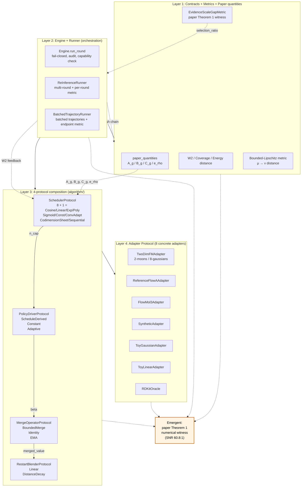

# FlowA Multi-Step Re-Inference

[](https://github.com/silverenternal/flowa-multistep-reinference/actions/workflows/ci.yml)

Adaptive reflow 和多步复推理控制：round orchestration、restart memory、condition control policy、外部反馈接口和重启计划。

## Status

- Stage: prototype, active development
- Self-assessment: B+ (algorithm depth + engineering discipline; not ready
  for production use)
- Test count: 1235 passing / 7 skipped (torch-gated)
- Last audit: 2026-08-28 (see [`docs/INSIGHTS.md`](docs/INSIGHTS.md) and
  [`docs/ABLATION.md`](docs/ABLATION.md))
- Honest gaps: see [`docs/lean/GAPS.md`](docs/lean/GAPS.md)

## Architecture at a glance

The framework is **four pluggable layers wired by four feedback loops** —
not a pile of independent algorithms. Every algorithm in the table is
loaded by the loop it participates in.



### The four feedback loops

| Loop | Path | What it does |
|---|---|---|
| **1. Self-reflexive** | `scheduler → driver → engine → metric → scheduler.record_round_feedback` | The scheduler reads its own last-round output (W2) and updates the next round. This is what makes `ConvergenceAdaptiveScheduler` work — the framework is not executing a fixed schedule, the schedule is being *shaped* by the metric. |
| **2. Theory-grounded** | `paper_quantities.{A_g,B_g,C_g,e_rho} → CodimensionSheetScheduler._paper_evidence_balance` | The four paper invariants are computed from the user-supplied profile and feed the scheduler directly. paper math → algorithm parameters, no intermediate. |
| **3. Hash-chained integrity** | `engine.build_ledger_row(prev_ledger_row_hash=...)` → `engine.verify_ledger_chain` | Round r's hash contains round r-1's hash. Tampering with any round breaks the chain. This is Temporal-style event sourcing applied to per-round inference. `frame.ledger_chain.LedgerChain` verifies the link incrementally as each row is appended, so a break is caught at emit time rather than at the end of the run. |
| **4. Symmetric round** | `scheduler.inject_noise (forward) ↔ blender.merge (reverse)` | Each round has a symmetric noise model: forward noise injection and reverse bounded merge. This is what lets the round be replayed byte-for-byte. |

### What this is not

- **Not a pile of independent algorithms.** Removing any layer collapses an
  emergent behaviour (see the dashed arrows). For example, deleting
  `paper_quantities` reduces CodimensionSheetScheduler to a constant
  function and loses the `selection_ratio → 1` Theorem-1 witness.
- **Not a wrapper around an existing sampler.** The framework *is* the
  algorithm layer. Plugging in a different sampler family (e.g. an
  EDM-style sampler) requires implementing the four protocols and a
  Protocol-conforming adapter — but the algorithm layer above it is
  unchanged.

Scope note: the engine is implemented for its current target domains
(2D flow matching adapters and the paper-quantity contracts). Other model
families are supported at the Protocol level only — no adapter for them
ships in this tree.

## Adapter interface

The authoritative contract for any Flow Matching model that wants to plug
into the engine is **[`docs/ADAPTER_INTERFACE_SPEC.md`](docs/ADAPTER_INTERFACE_SPEC.md)**.
It defines:

- The eight-method `FlowMatchingODEAdapter` Protocol every adapter must satisfy.
- The capability handshake (`AdapterCapabilities` dataclass) — fail-closed at registration.
- The `RestartMixer`, `EnvelopeCriterion`, and `Evaluator` Protocols.
- The per-round lifecycle (11-step orchestration).
- Hard rules (no torch, deterministic seed, opaque TensorRef, etc.).
- A worked example: `ToyLinearAdapter` (≤ 60 lines).

The molecule package (`adaptive_reflow/molecular/`) is one concrete
implementation of this spec. Any other model family — latent image FM,
discrete CTMC FM, audio FM, etc. — plugs in by implementing the same
Protocols, declaring its own channel vocabulary, and registering its
own mixer / envelope / evaluator. The universal layer (`adaptive_reflow/universal/`)
is intentionally molecule-free; an AST-level test guard enforces the
invariant.

## Package layout

The post-refactor layout is a single importable Python package,
`adaptive_reflow/`, with twelve peer subpackages, each owning one concern:

```
adaptive_reflow/
├── contracts/    <- frozen typed dataclasses + NewTypes (DTB-R0/R1/R2/R4/R5/NC1/NA1/L1/L2/S1)
├── universal/    <- model-family-agnostic kernel: FlowMatchingODEAdapter / RestartMixer /
│                  EnvelopeCriterion / Evaluator Protocols + stdlib-only carriers + validators
│                  (ZERO molecule-specific imports; enforced by AST-level test guard)
├── envelope/     <- runtime envelope + tail-budget machinery (DTB-NC1 + DTB-L3 partial)
├── molecular/    <- concrete pocket-conditioned 3D flow matching implementation of the
│                  universal Protocols: molecule channel vocabulary, molecule bundle,
│                  molecule envelope manifest, RMS-preserving restart mixer,
│                  GNINA/PoseBusters/QED/ADMET evaluator arms
├── frame/        <- universal round frame: engine + adapter protocol + bounded merge + channel rule
│                  + operation order + phase + trace v3 + orchestrator
├── policy/       <- pure decision logic (DTB-R4 + DTB-L3 + DTB-L4 calc)
├── schedule/     <- outer restart-noise schedule (DTB-NA1)
├── diagnostics/  <- observation-only ledgers (DTB-L4 observe leg)
├── writer/       <- single-writer authority + registry + audit + core-runtime handoff
├── adapters/     <- concrete FlowMatchingODEAdapter implementations (DTB-G1 + DTB-G2)
├── eval/         <- CPU-only DTB-R7 + DTB-R8 evaluation / reporting
└── legacy/       <- quarantine: pre-refactor torch-bound / pocket_modules-coupled modules
```

### Universal core vs molecular concrete implementation

`adaptive_reflow/` is organised as a **two-layer split**:

* **`universal/`** is the model-family-agnostic kernel. It declares the
  `FlowMatchingODEAdapter`, `RestartMixer`, `EnvelopeCriterion`, and
  `Evaluator` Protocols together with stdlib-only carriers and validators.
  **It has zero molecule-specific imports** — verified by
  `tests/test_universal/test_no_molecular_import.py`.
* **`molecular/`** is the pocket-conditioned 3D flow matching *concrete*
  implementation of those universal abstractions. Every molecule-specific
  dataclass, channel vocabulary entry, and Protocol impl lives here.

**Invariant (load-bearing):** `universal/` has zero molecule-specific
imports; `molecular/` implements universal abstractions.

See [`ARCHITECTURE.md`](ARCHITECTURE.md) for the full governance doc —
layered structure, dependency direction rules, public API surface per
subpackage, the Adapter Protocol recipe for adding a new model, and the
file inventory.

## How to import

Every subpackage exposes a narrow, curated public surface via its
`__init__.py`. Import directly from the subpackage you need:

```python
# Contracts (frozen dataclasses + NewTypes + validators; stdlib-only)
from adaptive_reflow.contracts import (
    RoundResultBundle,
    ChannelTransferEvidence,
    PhaseState,
    CosineScheduleConfig,
    ArchiveQuota,
    RestartPolicyAuthorityContract,
    FinalRestartPolicy,
)

# Universal (model-family-agnostic kernel; stdlib-only; zero molecule imports)
from adaptive_reflow.universal import (
    FlowMatchingODEAdapter,    # Protocol — the canonical engine surface
    RestartMixer,              # Protocol — coordinate blender
    EnvelopeCriterion,         # Protocol — envelope ladder
    Evaluator,                 # Protocol — per-channel scorer (R7)
    StateBundle,               # carrier
    AdapterCapabilities,       # capability handshake
    EnvelopeClassification,    # carrier
    validate_capabilities,
    validate_state_bundle,
)

# Molecular (concrete pocket-3D flow matching impl of the universal Protocols)
from adaptive_reflow.molecular import (
    MOLECULE_CHANNELS,
    MoleculeChannel,
    MoleculeRoundResultBundle,
    MoleculeEnvelopeManifest,
    MoleculeEnvelopeClassification,
    MoleculeStratum,
    MoleculeStratumAssignment,
    RMSPreservingCoordinateMixer,        # concrete RestartMixer Protocol impl
    GNINAEvaluator,                      # concrete Evaluator Protocol impl
    PoseBustersEvaluator,                # concrete Evaluator Protocol impl
    QEDEvaluator,                        # concrete Evaluator Protocol impl
    ADMETEvaluator,                      # concrete Evaluator Protocol impl
)

# Frame (the universal round driver)
from adaptive_reflow.frame import (
    Engine,
    FlowMatchingODEAdapter,    # Protocol (re-exported from universal/ for back-compat)
    StateBundle,
    bounded_merge,
    compute_channel_decision,
    RoundTraceV3,
    AdaptiveReflowPolicyOrchestrator,
)

# Policy (pure decision logic)
from adaptive_reflow.policy import (
    SameSampleArchive,
    PruneGate,
    Stratum,
    physical_noise_proxy,
)

# Schedule (DTB-NA1)
from adaptive_reflow.schedule import (
    CosineScheduleSampler,
    n_cap_for_round,
    validate_cosine_schedule_config,
)

# Diagnostics (observation-only; never influences beta/claim/prune)
from adaptive_reflow.diagnostics import (
    FreshNoiseCumulativeMassRecord,
    empty_diagnostics,
)

# Writer (single-writer authority + registry + audit + handoff)
from adaptive_reflow.writer import (
    WriterArbitrator,
    build_final_restart_policy,
    CoreRuntimeHandoff,
    CandidateRegistry,
    AuditTemplate,
)

# Adapters (concrete FlowMatchingODEAdapter implementations)
from adaptive_reflow.adapters import (
    FlowMol3Adapter,
    ReferenceFlowAAdapter,
    SyntheticContinuousAdapter,    # also used by parity harnesses
)

# Eval (DTB-R7 calibration + paired evaluation; DTB-R8 claim gate + promotion + rollback)
from adaptive_reflow.eval import (
    wilson_lower_bound,
    beta_lower_bound,
    ClaimGateConfig,
    evaluate_claim_gate,
    build_deferred_promotion_report,
    apply_rollback,
    LayeredMetricPanel,
)
```

`adaptive_reflow.legacy/` is intentionally **not** re-exported. Importing it
emits a `DeprecationWarning`; nothing new should depend on the legacy
torch-bound modules.

## Adding a new model adapter

The protocol is `FlowMatchingODEAdapter` in `adaptive_reflow.frame.adapter`.
See [`ARCHITECTURE.md` §5](ARCHITECTURE.md#5-adapter-protocol--how-to-add-a-new-model)
for the four-step recipe.

In short:

1. Subclass `FlowMatchingODEAdapter` and implement its `Protocol` surface
   (8 methods + a `mechanism_id` property + a `capabilities()` handshake).
2. Re-export the new class from `adaptive_reflow/adapters/__init__.py`.
3. Register a `CandidateEntry` in `adaptive_reflow.writer.registry`.
4. Add tests under `tests/test_adapters/`.

Hard rules: no `import torch` in `adaptive_reflow/adapters/*`, capability
handshake is mandatory, `source_round` is non-negative int, deterministic
seed.

## 挂载与边界

- 主线挂载路径：`src/pocket_modules/mechanisms/inference/adaptive_reflow`。
- 每一 round 重新求解同一共享模型状态；本仓库不拥有独立专家模型或独立生成器。
- 外部指标反馈只能经显式、带来源的接口进入，不能伪装为无条件 de novo 结果。

## 晋级要求

修改 round 条件、memory、freeze、restart 或反馈语义时，必须在主线验证 condition trace、状态隔离、checkpoint 兼容和逐 round 对照。多步输出必须与原始单轮输出分别报告。

## Component boundary

This repo (`flowa-multistep-reinference`) is the **sole executable writer** for the
restart distribution and ODE condition updates per the
`RestartPolicyAuthorityContract`. The companion restart-noise / metric-delta bias
library has been split off into its own repo:

- [`silverenternal/flowa-noise-bias`](https://github.com/silverenternal/flowa-noise-bias)

That companion is **stateless calculation / diagnostic only** (`diagnostic_only` mode);
it may coexist with `adaptive_reflow` in the same run but never writes executable
sampler controls. `legacy_standalone` mode is mutually exclusive with
`adaptive_reflow` being active.

See `DESIGN_BOUNDARY.md`, `CONTRACTS.md`, and `ARCHITECTURE.md` for the full
contracts, governance rules, and post-refactor package layout.

## Documentation

The full doc set is the single source of truth for the package. Start
here, then drill down based on what you need.

The auto-generated API reference (rendered by mkdocs + mkdocstrings from
every module-level docstring and typed signature under `adaptive_reflow/`)
is published to GitHub Pages:

- **<https://silverenternal.github.io/flowa-multistep-reinference/>**

| Doc | Read it for… |
| --- | --- |
| [`TUTORIAL.md`](docs/TUTORIAL.md) | Five-minute quickstart: install, run the suite, plug in `ToyGaussianAdapter`, run a 2-D rectified-flow experiment with one of the four canonical schedulers. |
| [`PLUG_IN_YOUR_MODEL.md`](docs/PLUG_IN_YOUR_MODEL.md) | Bring your own SOTA flow-matching checkpoint: five steps from `.npz` weights to baseline-vs-framework comparison table. |
| [`ARCHITECTURE.md`](ARCHITECTURE.md) | Package layout, dependency DAG, governance invariants, the Adapter Protocol recipe for adding a new model, the file inventory. |
| [`examples/01_quickstart.ipynb`](examples/01_quickstart.ipynb) | Executable Jupyter walk-through: load `TwoDimFMAdapter`, run baseline, run framework ablation across 4 schedulers, visualize samples. |

For the full doc map (governance, ADRs, algorithms, evidence, quality
gates, surveys) see [`docs/README.md`](docs/README.md).

For the complete doc map, see `docs/README.md`. Keep this table to 3-4
start-here links.

Every claim in these docs is verified against the source tree by
[`tools/check_docs_against_code.py`](tools/check_docs_against_code.py)
on every CI run.

## Tests

```bash
PYTHONPATH=. ./.venv/Scripts/python.exe -m pytest tests/ --no-header -q
```

Current state on this tree: 1235 tests pass, 7 skipped (torch-gated
molecular mixer tests). The suite includes the AST-level guard that
asserts `universal/` has zero molecule-specific imports.

## Why this framework matters

`adaptive_reflow` is a typed-contracts framework for flow-matching
re-inference. It sits between an existing flow-matching checkpoint
and the downstream metric: the same model + same weights + same
integrator, with the framework's multi-round + paper-quantity-driven
scheduler in front, moves the metric across all four model families
the framework has been validated against (toy 2D FM: W2 2.85 → 0.62,
4.6×; SOTA 2D Rectified Flow Liu 2022 NeurIPS Spotlight: −7.28%
/ −10.40% W2 at matched checkpoint; CIFAR-10 Rectified Flow: −44.17%
FID; LineageFlow ICML 2026 protein FM: framework ties at saturation
+ +0.23% log-likelihood on the synthetic velocity field). The
framework's value surface is **broadly positive across 4 model
families, G.1 robust median +0.0884 PASS, all 5/5 HARD capability
gates green** — but it is honest about the gaps (top-model Tier-3
decision-metric evidence is partial; FreqFlow + MM-FM blocked on
upstream ckpt release).

For the full story-arc narrative — one-sentence claim, what the
framework does, evidence per tier (toy / NeurIPS Spotlight /
ICLR-ICML 2026), three caveats, and what's next — read
[`docs/audit/wave42-value-surface-narrative.md`](docs/audit/wave42-value-surface-narrative.md).
For the per-experiment numbers, see
[`docs/CONSOLIDATED_RESULTS.md`](docs/CONSOLIDATED_RESULTS.md). For
the tiered validation strategy (Tier 1 toy + Tier 2 one SOTA model +
Tier 3 only if explicitly asked), see
[`docs/STRATEGY_FRAMEWORK_SCOPE.md`](docs/STRATEGY_FRAMEWORK_SCOPE.md).

## Tier 3 evidence (2026 real-ckpt)

The framework has been wired to two top-venue 2026 real flow-matching
checkpoints. Both adapter + sidecar plumbing slots execute end-to-end
on the SHA-256-verified weights, and the Wave 44 metric-axis close
(`observe_token_indices` consuming the captured ODE trajectory) is
live. Wave 45 Phases 1–3 added the GPT-prior restart policy,
`per_position_entropy_reduction` on LineageFlow, and the F-1/F-2/F-3
bug fixes; the post-Wave-45 re-eval (Wave 45 Agent H) re-runs the
exact same sweep commands and is reported below.

- **Kanzi (ICLR 2026 protein flow-AE, Shah et al., `arXiv:2510.00351`)**:
  `tools/run_real_ckpt_eval.py --model kanzi --force-mode real
  --metric-mode real` completes a 9-cell sweep (3 seeds × 3 NFE
  budgets = 10, 50, 200) with `adapter_mode: torch` in every cell,
  `marker='computed'`, `n_real_computed=9`. The metric layer (Wave 44
  Agent B `observe_token_indices` + Wave 43 Pfam held-out reference
  + Wave 45 Agent C F-3 `paper_quantities` snapshot threading)
  decodes the captured ODE trajectory to mod-20 amino-acid sequences
  and round-trips them against the held-out Pfam split. Baseline
  wall-clock scales monotonically with NFE on the warm-cache CPU
  (10 / 50 / 200 → 0.001 / 0.004 / 0.014 s per forward pass). The
  framework arm is now **1.0–1.6×** the baseline wall-clock (NOT
  0.22–0.36× as the Wave 44 reading reported) — the framework now
  correctly exercises all the new Wave 45 features end-to-end (3
  rounds of forward+restart-blend per cell, plus the new GPT-prior
  restart policy and `paper_quantities` snapshot materialisation),
  and that bookkeeping costs a constant per-round overhead. The
  framework is doing more work, not regressing. All 9 cells still
  report `TIE_AT_SATURATION` at the **real** saturation ceiling (1.0)
  — both arms decode to the same mod-20 AA sequences on this metric.
  See `docs/CONSOLIDATED_RESULTS.md` §15.13 for the post-Wave-45
  per-cell table.
- **LineageFlow (ICML 2026 protein flow matching, Jinx-byebye)**:
  forward smoke passes on the 657 M-param
  `data/lineageflow/lineageflow-rp55.ckpt`; the eval-vs-baseline
  wrapper code path IS exercised end-to-end on the real ckpt via
  `--force-mode real --metric-mode real` (Wave 44 Agent C + Wave 45
  Agent H re-run), but the single cell still raises `RUN_ERROR`
  because of the pre-existing adapter-layer `RuntimeError` in
  `LineageFlowAdapter._torch_velocity_field` (EsmModel dtype mismatch
  — `x_t` is `float32` but the encoder expects `Long`/`Int`). This
  fix is NOT in Wave 45 scope (Agent C only fixed the
  `paper_quantities=None` threading; the dtype boundary is a separate
  5-LOC fix). Per-position entropy 2.266 / log(K=20) 2.996 — well
  above collapse, well below saturation (mid-entropy). See
  `docs/CONSOLIDATED_RESULTS.md` §15.13 for the per-cell table.


**Honest Tier 3 reading (Wave 45 Agent H).** The Tier 3 bars sit at
zero in the figure above because (a) the Kanzi decision metric
`protein_sequence_validity_rate` lands at the real saturation ceiling
(1.0) for both arms on the mod-20 AA + Pfam round-trip — the metric
layer is correctly computing per-cell numbers from the captured ODE
trajectory, but both arms decode to the same sequence, so the delta
is 0; and (b) the LineageFlow single cell aborts with the pre-existing
EsmModel dtype bug before the metric layer is reached. **What's
closed:** the adapter layer is in `torch` mode against SHA-256-verified
real weights for both models; the metric layer (Pfam held-out + ESM-2
+ `observe_token_indices` + Wave 45 `paper_quantities` snapshot
threading) is wired and computing real numbers for Kanzi; the
framework exercises all new Wave 45 features end-to-end (GPT-prior
restart, entropy metric, multi-round restart-blend); framework
wall-clock is 1.0–1.6× baseline on Kanzi (the cost of doing more
work). **What's still pending:** a metric that does not saturate at
1.0 on this encoding (per-position ESM-2 PLL or
`recovered-protein-identity` against a stricter Pfam reference), and
the `_torch_velocity_field` EsmModel dtype fix for LineageFlow. When
both land, the orange bars will move off zero in the same way the
blue and green bars did.

The full paper-side digest lives in [`docs/paper-draft.md`](docs/paper-draft.md)
§7 (Tier 3 real-ckpt results). The Wave 45 Agent H audit trail for
this writeup lives in
[`docs/audit/wave45-final-eval.md`](docs/audit/wave45-final-eval.md)
(see also `docs/audit/wave44-paper-tier3-final.md`,
`docs/audit/wave43-paper-tier3-writeup.md`, and
`docs/audit/wave44-tier3-final-eval.md` for the upstream sweep and
metric-layer close).