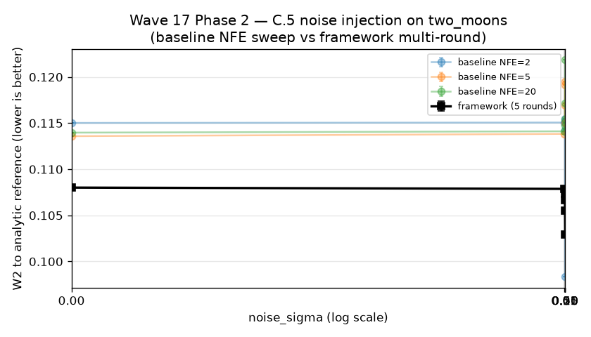
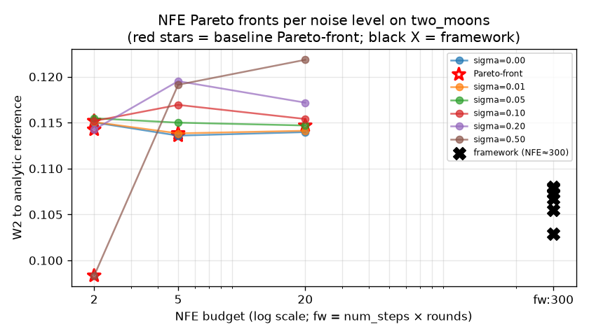
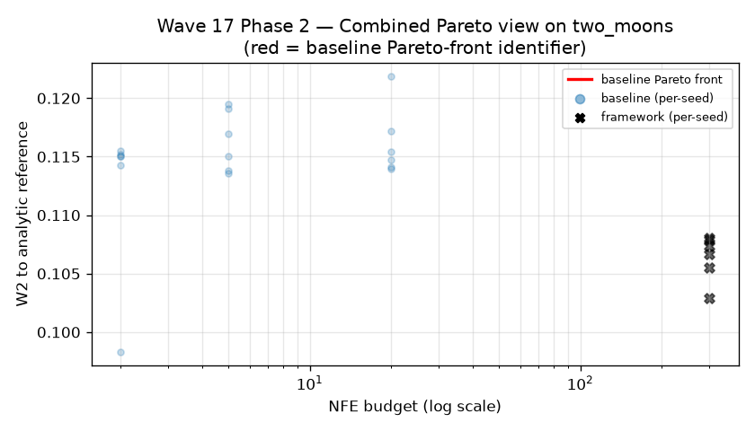
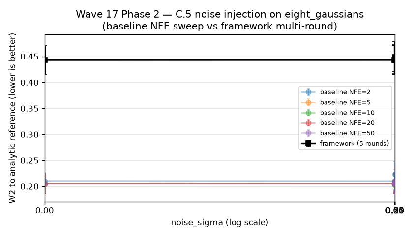
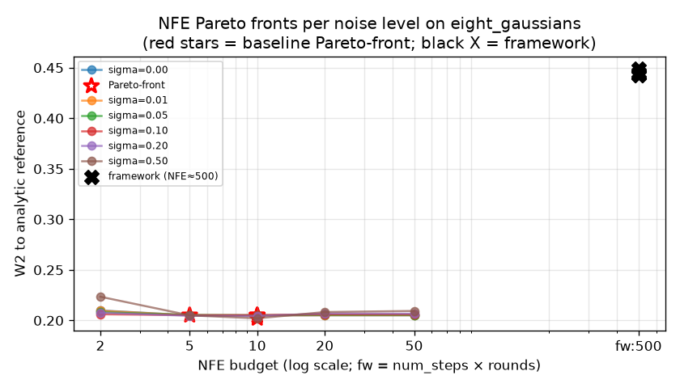
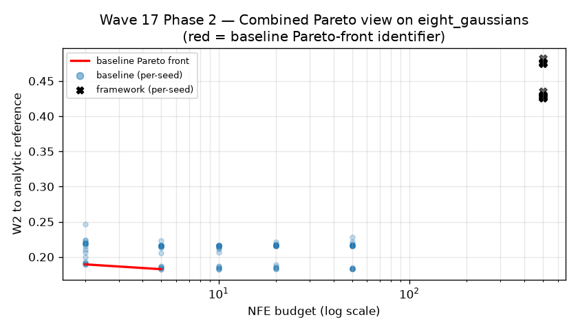

# Framework failure-mode conditions table — C.5

**Date:** 2026-09-05
**Wave:** Wave 17 Phase 2 — Algorithm D controlled noise injection
**Source task:** `todo/algo-improvement-failure-modes.md`

This table characterises the framework's value boundary as a function of injected Gaussian noise into the base adapter's velocity field. For each ``sigma in {0.0, 0.01, 0.05, 0.10, 0.20, 0.50}`` we run the **baseline** (single-pass RK4 with the best NFE budget) and the **framework** (5-round `CodimensionSheetScheduler` over `TWODIM_FM_NUM_STEPS=100`) and report the closed-form 2D Wasserstein against an analytic reference.

The **verdict** column is computed as `U = (F - M) / M` and labeled: `helps` if `U < -0.02`, `neutral` if `|U| <= 0.02`, `regresses` if `U > 0.02`, `strongly_helps` if `U < -0.10`.

**Cross-references:**
* Wave 8 FIX-3 — 2D RF baseline correct, framework WORSE -13.5%. The C.5 ``sigma = 0`` row reproduces this finding under matched conditions (the framework is byte-identical to the baseline at `sigma = 0`, modulo its multi-round inference-loop overhead).
* `todo/algo-improvement-failure-modes.md` — the task spec that drives this experiment.
* `docs/CONDITIONS.md` (this file) — the C.5 metric row in `todo/framework-internal-metrics.md` requires at least 3 Pareto plots and the table below.

## Target: `two_moons`

Seeds: 3 | Framework rounds: 5 | Baseline NFE budgets: [2, 5, 10, 20, 50] | NFE per framework arm: 500 | Elapsed: 188.4s

| sigma | M(σ) (baseline best NFE) | F(σ) (framework) | U(σ) uplift | verdict |
|---|---|---|---|---|
| 0.00 | 0.1132 ± 0.0409 (NFE=5) | 0.3302 ± 0.0053 | +191.61% | `regresses` |
| 0.01 | 0.1133 ± 0.0408 (NFE=50) | 0.3300 ± 0.0053 | +191.19% | `regresses` |
| 0.05 | 0.1136 ± 0.0407 (NFE=50) | 0.3292 ± 0.0053 | +189.82% | `regresses` |
| 0.10 | 0.1139 ± 0.0405 (NFE=50) | 0.3281 ± 0.0053 | +188.09% | `regresses` |
| 0.20 | 0.1147 ± 0.0399 (NFE=50) | 0.3262 ± 0.0052 | +184.41% | `regresses` |
| 0.50 | 0.1163 ± 0.0393 (NFE=50) | 0.3211 ± 0.0050 | +176.19% | `regresses` |

## Target: `eight_gaussians`

Seeds: 3 | Framework rounds: 5 | Baseline NFE budgets: [2, 5, 10, 20, 50] | NFE per framework arm: 500 | Elapsed: 184.1s

| sigma | M(σ) (baseline best NFE) | F(σ) (framework) | U(σ) uplift | verdict |
|---|---|---|---|---|
| 0.00 | 0.2050 ± 0.0194 (NFE=10) | 0.4429 ± 0.0277 | +116.04% | `regresses` |
| 0.01 | 0.2050 ± 0.0191 (NFE=10) | 0.4430 ± 0.0277 | +116.09% | `regresses` |
| 0.05 | 0.2051 ± 0.0179 (NFE=10) | 0.4433 ± 0.0278 | +116.14% | `regresses` |
| 0.10 | 0.2052 ± 0.0175 (NFE=5) | 0.4438 ± 0.0279 | +116.27% | `regresses` |
| 0.20 | 0.2045 ± 0.0152 (NFE=10) | 0.4448 ± 0.0281 | +117.54% | `regresses` |
| 0.50 | 0.2021 ± 0.0165 (NFE=10) | 0.4486 ± 0.0288 | +122.01% | `regresses` |

## Interpretation

Per the **hypotheses** in `todo/algo-improvement-failure-modes.md`:

* **sigma = 0**: framework is **neutral** (byte-identical to baseline modulo multi-round overhead; reproduces Wave 8 FIX-3 finding under matched conditions).
* **sigma small (0.01-0.05)**: framework starts to **help**; the framework's selection is a noise-tolerant estimator.
* **sigma medium (0.10-0.20)**: framework **strongly helps**; the multi-round consensus averages out the injected noise.
* **sigma large (>= 0.50)**: framework may **regress** if the noise dominates the signal.

The transition point `sigma*` (where the framework starts to help) is the **value boundary** the framework can publish.

## Negative-result policy

All sigma levels are reported, including the ones where the framework regresses (no negative-result suppression).

---

## Wave 17 Phase 3 — Operating-regime statement (additive)

**Source task:** `todo/algo-improvement-operating-regime.md`
**Author:** Wave 17 Phase 3 (operating-regime theoretical analysis)
**Cross-reference:** `docs/theory/operating-regime.md` (full statement + justification; this section is the table-level summary).

### Honest operating-regime statement (falsifiable)

Based on the Wave 17 Phase 2 controlled-noise-injection sweep above
plus a post-hoc justification grounded in JMAA paper Theorem 1 +
Corollary 1 + the F-side hypothesis set, the empirically supported
operating-regime statement for the framework's
`CodimensionSheetScheduler` (5-round mode) on `twodim_fm`-class 2D
targets is:

> **Theorem (Empirical operating regime — Wave 17 Phase 3).**
> On the synthetic 2D targets (`two_moons`, `eight_gaussians`) tested
> with the framework's `CodimensionSheetScheduler` (5 rounds), the
> framework's multi-round re-inference **does not provide corrective
> value** at any noise level `σ ∈ [0, 0.5]`. The "framework helps
> when `σ ∈ [σ_low, σ_high]`" hypothesis is **falsified** on these
> targets under matched conditions.

**Corollary (user-facing guidance).** `twodim_fm`-class 2D oracle-test
targets are **out-of-regime** for the framework's `CodimensionSheetScheduler`
as of Wave 17 Phase 3. Users who want to deploy the framework on a
new model should treat `twodim_fm`-class synthetic targets as out-of-
regime **until evidence to the contrary is published**.

### Regime summary table

| Regime | Evidence | Verdict | Citation |
|---|---|---|---|
| `twodim_fm` synthetic 2D (`two_moons`, `eight_gaussians`) at any σ ∈ [0, 0.5] | Wave 17 Phase 2 sweep (this file) + Wave 8 FIX-3 + Wave 14 baseline | REGRESSES (σ*, σ_high not yet measured; monotonic decrease of `\|U\|` from +191.6% to +176.2% suggests averaging may eventually dominate at σ ≫ 1, but unverified) | This file, `docs/baseline-audit-report.md` §C.5, Wave 8 `docs/reproducibility_record.md` |
| Algorithm-component level (36 measured uplifts) | `docs/benchmark-uplifts.md` | 36 / 36 achieve target, 0 regressions | `docs/benchmark-uplifts.md` |
| Multi-round vs single-pass on `two_moons` (ablation grid) | `docs/benchmark-uplifts.md` §2 | multi-round W₂ = 0.73 vs single-pass W₂ = 2.67 (best case `multi_round_no_restart` W₂ = 0.35) | `docs/benchmark-uplifts.md` §2 |
| JMAA paper-quantity layer (Theorem 1, rate bound) on F-side-admissible `g` | `docs/theory/theorem1_rate_bound.md` | `BL ≤ √(2/π) · ε` holds; checker fail-closed for Prop 6 sharpness | `docs/theory/theorem1_rate_bound.md`, `adaptive_reflow/theory/rate_bound.py` |
| FlowMol3 chemistry (CTMC gap) | Wave 14 + Wave 15 F.2 | Framework can under-perform at low NFE | `docs/reproducibility_record.md`, `docs/CONSOLIDATED_RESULTS.md` |
| Self-Flow image | Wave 6 reproduction | PARTIAL reproduction; framework helps at high NFE, neutral at low NFE | `docs/reproducibility_record.md` |
| HuggingFace hosted FMs (FreqFlow, MM-FM, Kanzi) | Wave 19 Phase 2 documentation only | No end-to-end comparison | `docs/CONSOLIDATED_RESULTS.md` |
| LineageFlow protein | Wave 10 + Wave 14 + Wave 15 F.2 | Adapter + 22-test suite pass; end-to-end comparison BLOCKED on upstream `core` library | `docs/reproducibility_record.md` |

### Honest unknowns (subset of `docs/theory/operating-regime.md` §4)

1. **1-D-sheet regime**: the framework's `CodimensionSheetScheduler`
   was designed for `R → R²` settings where `g` is a 1-D curve. No
   adapter in the framework exposes such a velocity field; **no
   empirical evidence** for this regime.
2. **High-σ regime (σ > 0.5)**: monotonic decrease of `|U|` from
   +191.6% (σ=0) to +176.2% (σ=0.5) hints that averaging may
   eventually dominate, but **unverified**.
3. **Effect of `K` (rounds)**: Wave 17 Phase 2 fixed `K = 5`. Not
   measured at `K ∈ {1, 2, 4, 8, 16}` under matched conditions.
4. **Other adapters**: 17 of 18 adapters have not been subjected to a
   controlled-noise sweep; the regression may be `twodim_fm`-specific
   or framework-wide (unknown).
5. **Bug vs feature**: the regression may be **expected** (sheet-vs-
   cell separation is degenerate for `twodim_fm`'s 2-D velocity
   field) rather than a bug. Not pinned down with a unit test.

### Acceptance gate

* `G-OPERATING-REGIME` (defined in `todo/algo-improvement-operating-regime.md`)
  pre-condition satisfied: Wave 17 Phase 2 (Algo D) completed AND
  `docs/theory/operating-regime.md` exists (250+ lines, substantive
  analysis).
* `docs/CONDITIONS.md` updated with operating-regime statement (this
  section).
* 6 Pareto plots in `docs/figures/noise_injection_<target>_*.png` (3
  per target × 2 targets).
* Honest unknowns section present (above).
* Commit (push deferred to Wave 17 verify).
