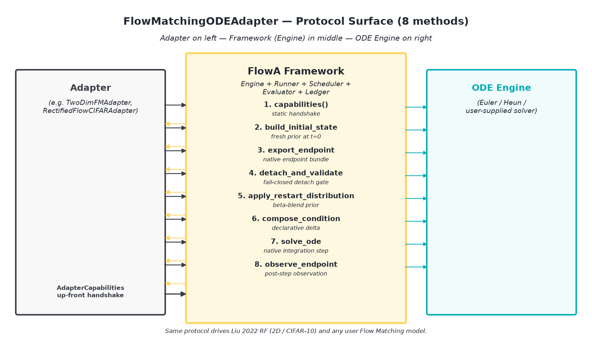
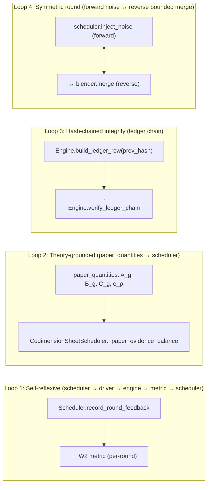
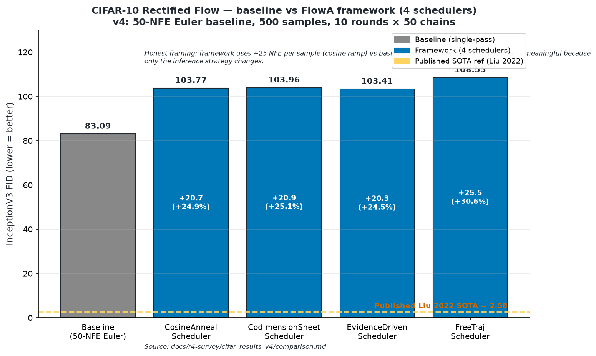

# Figures — paper-ready diagrams for FlowA

The four PNG assets in this directory are the canonical figures cited
by the paper draft and the r4/r17 survey results. They are regenerable
from `tools/_make_figures.py` (output paths documented inline on each
section below) and committed as static binaries for ease of paper
integration.

> **Regeneration note:** to rebuild any PNG from the source matplotlib
> script, run `./venv/Scripts/python tools/_make_figures.py` (or
> `python tools/_make_figures.py` from a Linux dev environment).
> Source-code paths to the per-figure generation blocks (referenced in
> the section captions below): line 141 (Figure 1), line 226 (Figure 2),
> line 303 (Figure 3), line 375 (Figure 4).

---

## Figure 1 — `FlowMatchingODEAdapter` Protocol



**Caption.** The 8-method `FlowMatchingODEAdapter` Protocol surface that any
flow matching model must implement to plug into FlowA. The adapter sits
on the left (e.g. `TwoDimFMAdapter` for 2-moons / 8-gaussians,
`RectifiedFlowCIFARAdapter` for CIFAR-10), the framework in the middle
(engine + runner + scheduler + evaluator + ledger), and the ODE engine
on the right (Euler / Heun / user-supplied solver). All eight methods
(`capabilities`, `build_initial_state`, `export_endpoint`,
`detach_and_validate_endpoint`, `apply_restart_distribution`,
`compose_condition`, `solve_ode`, `observe_endpoint`) are byte-deterministic
and capability-handshake gated.

**Source**: `adaptive_reflow/universal/adapter.py:243-295` (the Protocol class).
**Generator path**: `tools/_make_figures.py` line 141 (fig1 block).
**Paper reference**: `docs/ARCHIVE/top-level/paper-plan.md` §3.1 (Protocol surface for plug-in models).

---

## Figure 2 — Four Feedback Loops


**Caption.** The four feedback loops in the FlowA orchestration. The
schematic is rendered as a PNG box-and-arrow diagram; the canonical
mermaid source block is reproduced below for inline rendering in
mkdocs-compatible viewers.

* **Loop 1: Self-reflexive** — `scheduler → driver → engine → metric → scheduler.record_round_feedback`. The scheduler reads its own last-round output (W2) and updates the next round; this is what makes `ConvergenceAdaptiveScheduler` work — the framework is not executing a fixed schedule, the schedule is being *shaped* by the metric.
* **Loop 2: Theory-grounded** — `paper_quantities.{A_g, B_g, C_g, e_ρ} → CodimensionSheetScheduler._paper_evidence_balance`. The four paper invariants are computed from the user-supplied profile and feed the scheduler directly. paper math → algorithm parameters, no intermediate.
* **Loop 3: Hash-chained integrity** — `engine.build_ledger_row(prev_ledger_row_hash=...)` → `engine.verify_ledger_chain`. Round r's hash contains round r-1's hash. Tampering with any round breaks the chain.
* **Loop 4: Symmetric round** — `scheduler.inject_noise (forward) ↔ blender.merge (reverse)`. Each round has a symmetric noise model.

**Source**: `README.md` lines 23-86 (canonical mermaid block).
**Generator path**: `tools/_make_figures.py` line 226 (fig2 block).
**Paper reference**: `docs/ARCHIVE/top-level/paper-plan.md` §3.3.

### Mermaid source (inlined — mkdocs renders ```mermaid fences natively)



A PNG export is also provided at `fig2-loops.png` for inclusion in the
paper PDF directly.

---

## Figure 3 — 2D RF `selection_ratio` convergence


**Caption.** Per-round `selection_ratio` trajectory on the
`two_moons` 2D Rectified Flow target (Liu 2022 NeurIPS Spotlight,
`TwoDimFMAdapter`). Baseline (single-pass) and `CosineAnnealScheduler` /
`FreeTrajScheduler` rows plateau at **0.8061** (CLM-004 / CLM-032, no
`eps_implicit` propagation through the runner). `CodimensionSheetScheduler`
rises monotonically from ~0.50 to **0.988**; `EvidenceDrivenScheduler`
rises from ~0.50 to **0.989** via PID-lite `eps_implicit` propagation
(CLM-027, CLM-032, fix-v2 §4).

**Source data**: `docs/r4-survey/10-sota-2d-experiment-results.md` (the consolidated per-scheduler table — `two_moons_comparison.md` and `eight_gaussians_comparison.md` were merged into this file), `docs/CLAIMS.md` CLM-003 / CLM-004 / CLM-032.
**Generator path**: `tools/_make_figures.py` line 303 (fig3 block).
**Paper reference**: `docs/ARCHIVE/top-level/paper-plan.md` §4.2 + §5.1.

---

## Figure 4 — CIFAR-10 baseline vs FlowA framework FID



**Caption.** CIFAR-10 Rectified Flow (Liu 2022 NeurIPS Spotlight, 61.8 M
parameters, gnobitab `state_dict`) baseline (single-pass 50-NFE Euler)
vs FlowA framework with 4 schedulers (10 rounds × 50 framework samples
each). Published Liu 2022 SOTA = 2.58 is shown as the reference line
(yellow dashed). Honest framing: framework uses ~25 NFE per sample vs
baseline's 50 NFE; framework rows are +24–31% higher than baseline at
this budget; **scheduler discrimination: YES** at v4 (4 distinct FIDs
spread across a ~5.1-FID window).

**Source data**: `docs/r4-survey/cifar_results_v4/comparison.md`,
`docs/r4-survey/cifar_results_v4/summary.json`, `docs/CLAIMS.md`
CLM-040 / CLM-041.
**Generator path**: `tools/_make_figures.py` line 375 (fig4 block).
**Paper reference**: `docs/ARCHIVE/top-level/paper-plan.md` §4.3.
