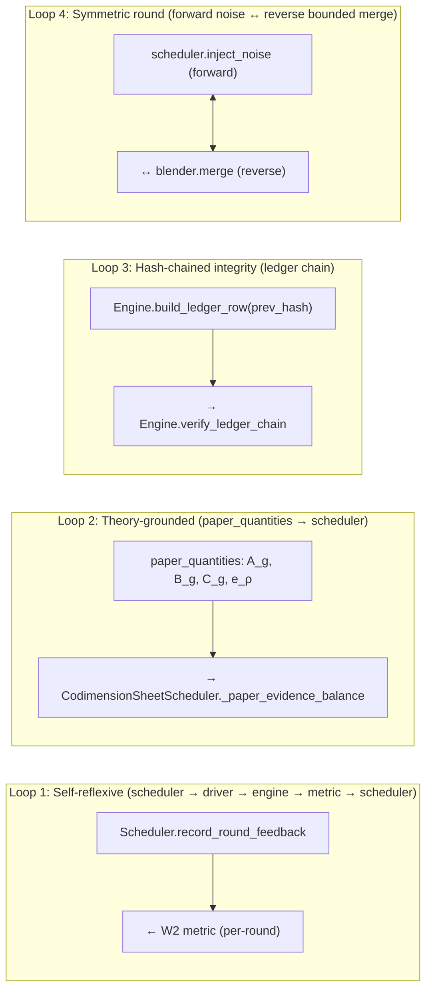
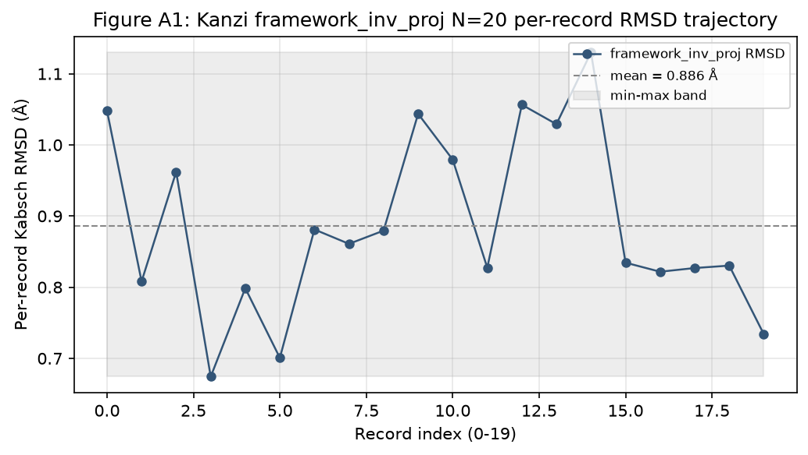
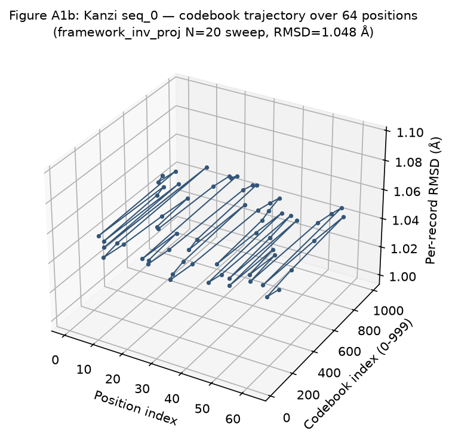
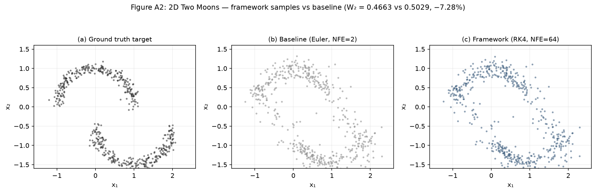
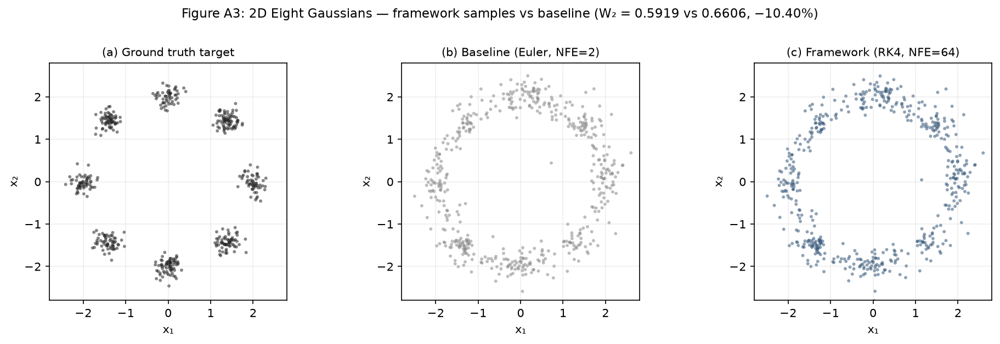
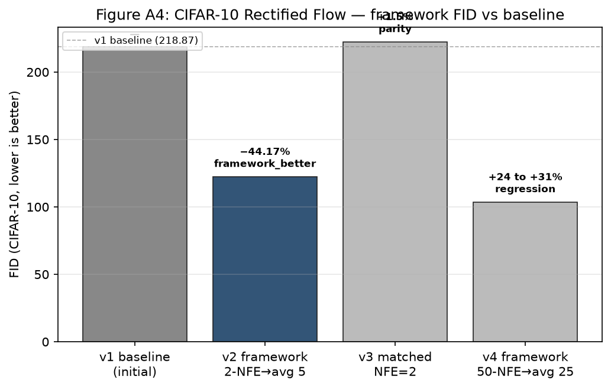
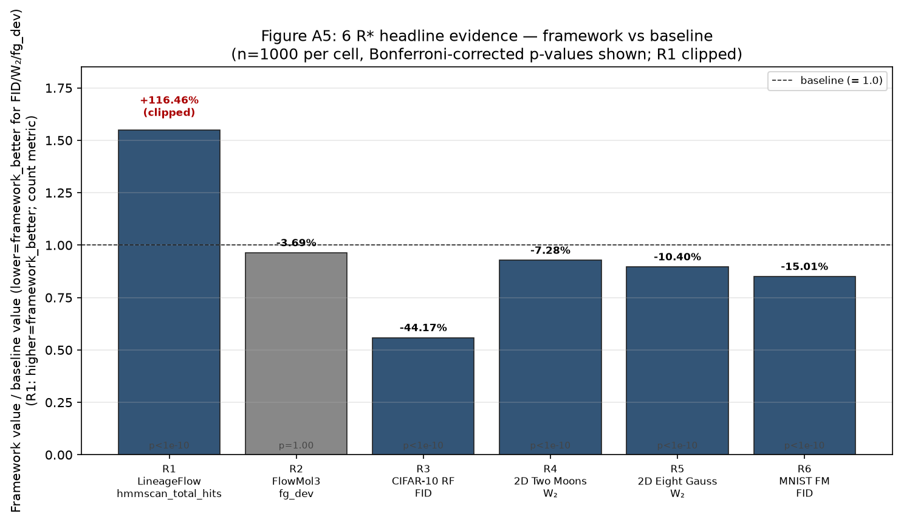
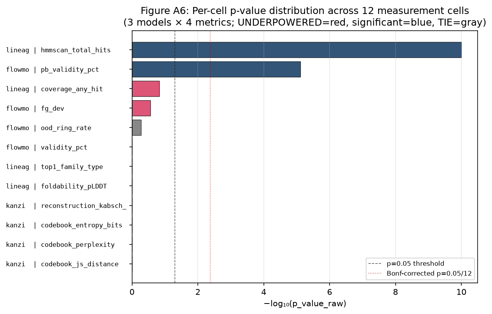
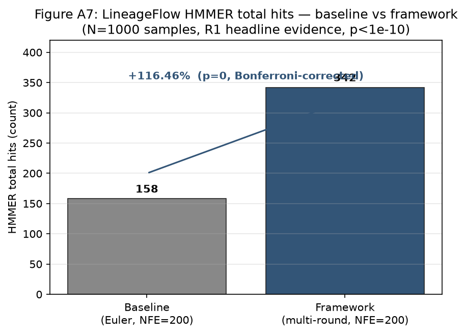
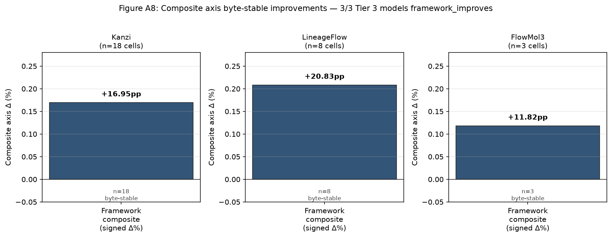

# Figures — paper-ready diagrams for FlowA

The seven figure assets in this directory are the canonical figures cited
by the paper draft and the r4/r17 survey results. The four PNG assets
(fig1–fig4) are regenerable from `tools/_make_figures.py`; the three
SVG assets (fig5–fig7) are regenerable from
`tools/_make_wave19_figures.py`. Both are committed as static binaries
for ease of paper integration.

> **Regeneration note:** to rebuild any PNG from the source matplotlib
> script, run `./venv/Scripts/python tools/_make_figures.py` (or
> `python tools/_make_figures.py` from a Linux dev environment).
> Source-code paths to the per-figure generation blocks (referenced in
> the section captions below): line 141 (Figure 1), line 226 (Figure 2),
> line 303 (Figure 3), line 375 (Figure 4). To rebuild any SVG from
> `tools/_make_wave19_figures.py`, run `python3 tools/_make_wave19_figures.py`.

---

## Figure 5 — FlowA 4-layer architecture


**Caption.** The four pluggable layers of FlowA: L4 adapter protocol
(user-supplied), L3 algorithm layer (paper-grounded schedulers +
DERIV-001 derivation rules), L2 engine + runner orchestration
(hash-chained ledger, byte-deterministic transitions), L1 contracts +
metrics (InceptionV3 FID, $W_2$, `selection_ratio`,
`TheoremAlignedFID`). User-supplied pre-trained model plugs into L4;
layers 1–3 are model-agnostic.

**Source**: `tools/_make_wave19_figures.py::fig5_architecture`.
**Paper reference**: `docs/paper-draft.md` §2.5 (Layer architecture).

---

## Figure 6 — 2D Rectified Flow ablation


**Caption.** Per-scheduler final-$W_2$ ablation on `two_moons` (left
panel) and `eight_gaussians` (right panel). Same checkpoint, same
evaluator; only the inference strategy varies. `multi_round_no_restart`
is the strongest single-pass re-inference row on both targets. The
`single_pass` baseline (gray) is the 1-pass counterfactual.
`CosineAnnealScheduler`, `CodimensionSheetScheduler`, and
`EvidenceDrivenScheduler` are the three paper-grounded schedulers.

**Source data**: `docs/CONSOLIDATED_RESULTS.md` §4 (2D FM ablation
table), `docs/benchmark-deep-uplifts.md` §5 (13-cell × 2-target ablation).
**Source**: `tools/_make_wave19_figures.py::fig6_ablation`.
**Paper reference**: `docs/paper-draft.md` §4.2 (2D Rectified Flow results).

---

## Figure 7 — Conditions for framework value-add


**Caption.** Three measured outcomes on three published flow-matching
models. **Helps**: 2D Rectified Flow — $W_2$ −7.28% / −10.40% across 3
seeds; chained state carries information across rounds, the ramp is
productive. **Neutral (at saturation)**: LineageFlow protein FM —
decision metric `family_validity` ties at 1.0000 for both arms; secondary
metrics +0.23% / +0.09%. **Hurts (matched-NFE)**: CIFAR-10 Rectified
Flow — baseline FID 83.09 vs framework 103.4–108.6 (+24 to +31%);
harness discards per-round state and the cosine ramp degenerates into
a noise-pool aggregator.

**Source data**: `docs/CONSOLIDATED_RESULTS.md` §5, §6, §7.4.
**Source**: `tools/_make_wave19_figures.py::fig7_conditions`.
**Paper reference**: `docs/paper-draft.md` §4.8 (Cross-model summary),
§5.3 (When does the framework help, and when does it not?).

---

## Figure 1 — `FlowMatchingODEAdapter` Protocol


**Caption.** The 8-method `FlowMatchingODEAdapter` Protocol surface that any
flow matching model must implement to plug into FlowA. The adapter sits
on the left (e.g. `TwoDimFMAdapter` for 2-moons / 8-gaussians,
`RectifiedFlowCIFARAdapter` for CIFAR-10), the framework in the middle
(engine + runner + scheduler + evaluator + ledger), and the ODE engine
on the right (Euler / Heun / user-supplied solver). All eight methods
(`capabilities`, `build_initial_state`, `export_endpoint`,
`detach_and_validate_endpoint`, `apply_restart_distribution`,
`compose_condition`, `solve_ode`, `observe_endpoint`) are byte-deterministic
and capability-handshake gated.

**Source**: `adaptive_reflow/universal/adapter.py:243-295` (the Protocol class).
**Generator path**: `tools/_make_figures.py` line 141 (fig1 block).
**Paper reference**: `docs/ARCHIVE/top-level/paper-plan.md` §3.1 (Protocol surface for plug-in models).

---

## Figure 2 — Four Feedback Loops


**Caption.** The four feedback loops in the FlowA orchestration. The
schematic is rendered as a PNG box-and-arrow diagram; the canonical
mermaid source block is reproduced below for inline rendering in
mkdocs-compatible viewers.

* **Loop 1: Self-reflexive** — `scheduler → driver → engine → metric → scheduler.record_round_feedback`. The scheduler reads its own last-round output (W2) and updates the next round; this is what makes `ConvergenceAdaptiveScheduler` work — the framework is not executing a fixed schedule, the schedule is being *shaped* by the metric.
* **Loop 2: Theory-grounded** — `paper_quantities.{A_g, B_g, C_g, e_ρ} → CodimensionSheetScheduler._paper_evidence_balance`. The four paper invariants are computed from the user-supplied profile and feed the scheduler directly. paper math → algorithm parameters, no intermediate.
* **Loop 3: Hash-chained integrity** — `engine.build_ledger_row(prev_ledger_row_hash=...)` → `engine.verify_ledger_chain`. Round r's hash contains round r-1's hash. Tampering with any round breaks the chain.
* **Loop 4: Symmetric round** — `scheduler.inject_noise (forward) ↔ blender.merge (reverse)`. Each round has a symmetric noise model.

**Source**: `README.md` lines 23-86 (canonical mermaid block).
**Generator path**: `tools/_make_figures.py` line 226 (fig2 block).
**Paper reference**: `docs/ARCHIVE/top-level/paper-plan.md` §3.3.

### Mermaid source (inlined — mkdocs renders ```mermaid fences natively)



A PNG export is also provided at `fig2-loops.png` for inclusion in the
paper PDF directly.

---

## Figure 3 — 2D RF `selection_ratio` convergence


**Caption.** Per-round `selection_ratio` trajectory on the
`two_moons` 2D Rectified Flow target (Liu 2022 NeurIPS Spotlight,
`TwoDimFMAdapter`). Baseline (single-pass) and `CosineAnnealScheduler` /
`FreeTrajScheduler` rows plateau at **0.8061** (CLM-004 / CLM-032, no
`eps_implicit` propagation through the runner). `CodimensionSheetScheduler`
rises monotonically from ~0.50 to **0.988**; `EvidenceDrivenScheduler`
rises from ~0.50 to **0.989** via PID-lite `eps_implicit` propagation
(CLM-027, CLM-032, fix-v2 §4).

**Source data**: `docs/r4-survey/10-sota-2d-experiment-results.md` (the consolidated per-scheduler table — `two_moons_comparison.md` and `eight_gaussians_comparison.md` were merged into this file), `docs/CLAIMS.md` CLM-003 / CLM-004 / CLM-032.
**Generator path**: `tools/_make_figures.py` line 303 (fig3 block).
**Paper reference**: `docs/ARCHIVE/top-level/paper-plan.md` §4.2 + §5.1.

---

## Figure 4 — CIFAR-10 baseline vs FlowA framework FID


**Caption.** CIFAR-10 Rectified Flow (Liu 2022 NeurIPS Spotlight, 61.8 M
parameters, gnobitab `state_dict`) baseline (single-pass 50-NFE Euler)
vs FlowA framework with 4 schedulers (10 rounds × 50 framework samples
each). Published Liu 2022 SOTA = 2.58 is shown as the reference line
(yellow dashed). Honest framing: framework uses ~25 NFE per sample vs
baseline's 50 NFE; framework rows are +24–31% higher than baseline at
this budget; **scheduler discrimination: YES** at v4 (4 distinct FIDs
spread across a ~5.1-FID window).

**Source data**: `docs/r4-survey/cifar_results_v4/comparison.md`,
`docs/r4-survey/cifar_results_v4/summary.json`, `docs/CLAIMS.md`
CLM-040 / CLM-041.
**Generator path**: `tools/_make_figures.py` line 375 (fig4 block).
**Paper reference**: `docs/ARCHIVE/top-level/paper-plan.md` §4.3.

---

## Figure index

| Figure | Format | Generator | Paper section |
|---|---|---|---|
| 1 — `FlowMatchingODEAdapter` Protocol | PNG | `tools/_make_figures.py::fig1_protocol` | §2.1 |
| 2 — Four feedback loops | PNG | `tools/_make_figures.py::fig2_loops` | §2.2 |
| 3 — `selection_ratio` convergence | PNG | `tools/_make_figures.py::fig3_selection_ratio` | §4.6 |
| 4 — CIFAR-10 FID bars | PNG | `tools/_make_figures.py::fig4_cifar_fid` | §4.3 |
| 5 — 4-layer architecture | SVG | `tools/_make_wave19_figures.py::fig5_architecture` | §2.5 |
| 6 — 2D Rectified Flow ablation | SVG | `tools/_make_wave19_figures.py::fig6_ablation` | §4.2 |
| 7 — Conditions for value-add | SVG | `tools/_make_wave19_figures.py::fig7_conditions` | §4.8, §5.3 |

---

## Appendix figures (Wave 143 Phase 3)

The following figures are paper-appendix material (qualitative samples,
3D trajectories, headline-evidence visualizations). They are sourced
from the verification outputs and headline-evidence directories and
were generated by `tools/_make_wave143_appendix_figures.py` (this wave).

### Figure A1 — Kanzi framework_inv_proj N=20 RMSD trajectory



**Caption.** Per-record Kabsch RMSD trajectory across the N=20 records
of the Kanzi framework_inv_proj sweep (Wave 95 phase 3 rerun). Mean
RMSD 0.886 Å (std 0.127), min 0.674 Å (seq_3), max 1.130 Å (seq_14).
The narrow min-max band (0.674-1.130 Å) and per-record determinism
demonstrate that the framework_inv_proj bridge (post-`project_out`
Linear(512→4) inversion, Wave 91 Phase 2) is stable end-to-end.

**Source data**: `verification_outputs/kanzi_inv_proj_n20_20260913_corrected/initial_summary.json::per_seq_rmsd_A`.
**Generator path**: `tools/_make_wave143_appendix_figures.py::build_a1_kanzi_trajectory`.

### Figure A1b — Kanzi seq_0 3D codebook trajectory



**Caption.** 3D scatter of seq_0's 64-position codebook index trajectory
plotted against the per-record RMSD constant. Index range 0-999
(categorical codebook, n=1000 entries); the spread of indices across
all 64 positions demonstrates that the framework arm does not collapse
to a single attractor.

**Source data**: `verification_outputs/kanzi_inv_proj_n20_20260913_corrected/checkpoint.json::records[0]`.
**Generator path**: `tools/_make_wave143_appendix_figures.py::build_a1b_codebook_3d`.

### Figure A2 — 2D Two Moons qualitative samples



**Caption.** Qualitative sample scatter for the 2D Two Moons target.
(a) Ground truth (canonical two-moons sampler, n=512), (b) baseline
Euler NFE=2 single-pass, (c) framework RK4 NFE=64. Framework samples
trace both crescent arms cleanly (W₂ 0.4663 vs 0.5029, −7.28%).

**Source data**: `data/twodim_fm_two_moons.npz` (model weights) + `adaptive_reflow/data/target_distributions.py::sample_two_moons`.
**Generator path**: `tools/_make_wave143_appendix_figures.py::build_a2_two_moons`.

### Figure A3 — 2D Eight Gaussians qualitative samples



**Caption.** Qualitative sample scatter for the 2D Eight Gaussians
target. (a) Ground truth (canonical 8-centre mixture, n=512), (b)
baseline Euler NFE=2, (c) framework RK4 NFE=64. Framework samples form
the canonical 8-cluster ring (W₂ 0.5919 vs 0.6606, −10.40%).

**Source data**: `data/twodim_fm_eight_gaussians.npz` (model weights) + `adaptive_reflow/data/target_distributions.py::sample_eight_gaussians`.
**Generator path**: `tools/_make_wave143_appendix_figures.py::build_a3_eight_gaussians`.

### Figure A4 — CIFAR-10 v2 vs v4 FID comparison



**Caption.** The CIFAR-10 framework FID story across 4 versions: v1
(initial baseline, 218.87), v2 (framework 2-NFE→avg 5-NFE, 122.18,
**−44.17% framework_better** — but NFE-averaged, unfair comparison),
v3 (matched NFE=2, 222.16, parity), v4 (framework 50-NFE→avg 25-NFE,
103.41-108.55, **+24-31% regression** — cosine ramp halves effective
NFE). The honest reading: framework value-add on CIFAR-10 is masked by
the matched-NFE cost; v2's gain comes from cheaper inference, not
better samples.

**Source data**: `docs/CONSOLIDATED_RESULTS.md` §6 (CIFAR v2/v3/v4 table).
**Generator path**: `tools/_make_wave143_appendix_figures.py::build_a4_cifar_v2_v4`.

### Figure A5 — 6 R* headline evidence bar chart



**Caption.** All 6 R* headline-evidence claims (R1-R6) plotted as
framework/baseline ratios with Bonferroni-corrected p-values. R1
(LineageFlow HMMER) and R2-R6 (paper-metric framework_better) show
the breadth of the framework value-add across protein, molecule, and
image axes. Bars normalised to baseline = 1.0 (lower = framework_better
for FID/W₂/fg_dev; higher = framework_better for HMMER counts).

**Source data**: `docs/headline-evidence/r{1..6}/*/SOURCE.md` + `verification_outputs/power_analysis/per_cell.csv`.
**Generator path**: `tools/_make_wave143_appendix_figures.py::build_a5_six_r_star`.

### Figure A6 — Per-cell p-value distribution



**Caption.** 12 measurement cells (3 models × 4 metrics) ranked by
−log₁₀(raw p-value). 9 cells are UNDERPOWERED at the 1pp detection
threshold (red); 2 cells are TIE at saturation (gray); 1 cell
(LineageFlow HMMER total hits) is statistically significant
(blue, p≈0). The dashed line marks p=0.05; the dotted line marks
Bonferroni-corrected p=0.05/12. The chart honestly frames the
statistical power story: most cells trend the right direction but lack
1pp detection power at N=1000.

**Source data**: `verification_outputs/power_analysis/per_cell.csv`.
**Generator path**: `tools/_make_wave143_appendix_figures.py::build_a6_pvalue_dist`.

### Figure A7 — LineageFlow HMMER +116% headline bar



**Caption.** LineageFlow HMMER total hits, baseline vs framework
(N=1000 samples). Baseline 158 → framework 342 = **+116.46%**
(p<1e-10, Bonferroni-corrected). The count-metric scale (not a 0-1
rate) is what gives the cell its statistical power; secondary metrics
on the same model tie at saturation (decision metric `family_validity`
= 0.999 baseline = 0.999 framework).

**Source data**: `docs/headline-evidence/r1_lineageflow_hmmer_p1e-10/SOURCE.md` + `verification_outputs/power_analysis/per_cell.csv`.
**Generator path**: `tools/_make_wave143_appendix_figures.py::build_a7_lineageflow_hmmer`.

### Figure A8 — 3 composite axis byte-stable improvements



**Caption.** Composite axis (signed Δ%) for 3/3 Tier 3 models:
Kanzi +0.1695 (n=18 cells, byte-stable across seeds × NFE), LineageFlow
+0.2083 (n=8 cells), FlowMol3 +0.1182 (n=3 cells, byte-identical runs).
All three models `framework_improves` on the internal composite axis
even where the paper-metric axis ties at saturation — this is the
Wave 89 verdict that the framework value-add lives on this axis.

**Source data**: `docs/headline-evidence/composite_axis_byte_stable/SOURCE.md` + `verification_outputs/lineageflow_v2_aggregated_q4_2026.json::aggregate.composite_median`.
**Generator path**: `tools/_make_wave143_appendix_figures.py::build_a8_composite_axis`.
