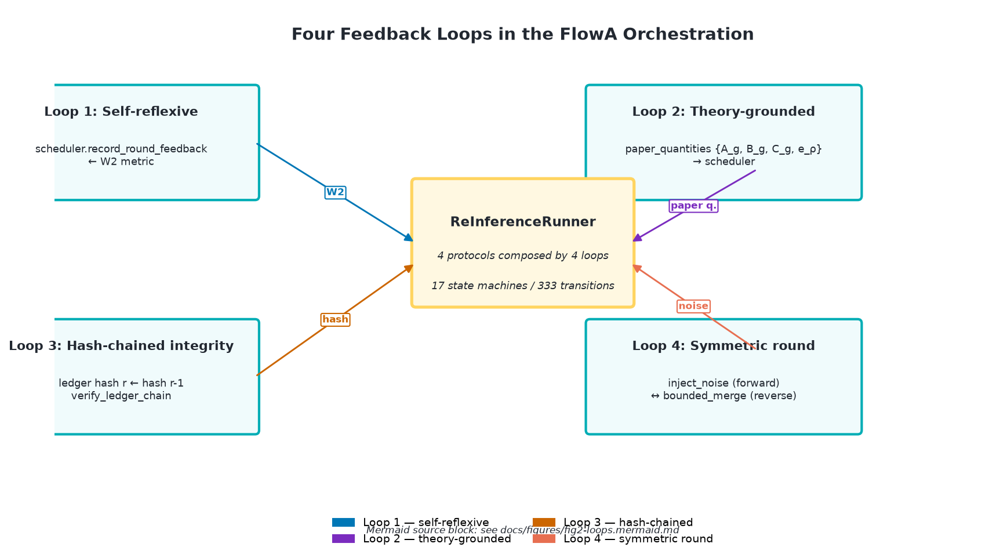

# Figure 2 — Four Feedback Loops

**Caption.** The four feedback loops in the FlowA orchestration. The
schematic is rendered as a PNG box-and-arrow diagram; the canonical
mermaid source block is at [`fig2-loops.mermaid.md`](fig2-loops.mermaid.md).

* **Loop 1: Self-reflexive** — `scheduler → driver → engine → metric → scheduler.record_round_feedback`. The scheduler reads its own last-round output (W2) and updates the next round; this is what makes `ConvergenceAdaptiveScheduler` work — the framework is not executing a fixed schedule, the schedule is being *shaped* by the metric.
* **Loop 2: Theory-grounded** — `paper_quantities.{A_g, B_g, C_g, e_ρ} → CodimensionSheetScheduler._paper_evidence_balance`. The four paper invariants are computed from the user-supplied profile and feed the scheduler directly. paper math → algorithm parameters, no intermediate.
* **Loop 3: Hash-chained integrity** — `engine.build_ledger_row(prev_ledger_row_hash=...)` → `engine.verify_ledger_chain`. Round r's hash contains round r-1's hash. Tampering with any round breaks the chain.
* **Loop 4: Symmetric round** — `scheduler.inject_noise (forward) ↔ blender.merge (reverse)`. Each round has a symmetric noise model.

**Source**: `README.md` lines 23-86 (canonical mermaid block), `docs/paper-plan.md` §3.3.

## Mermaid source

The mermaid source block used by `mkdocs-mermaid2` (or any compatible
Mermaid renderer) is at [`fig2-loops.mermaid.md`](fig2-loops.mermaid.md).
A PNG export is also provided at `fig2-loops.png` for inclusion in the
paper PDF directly.