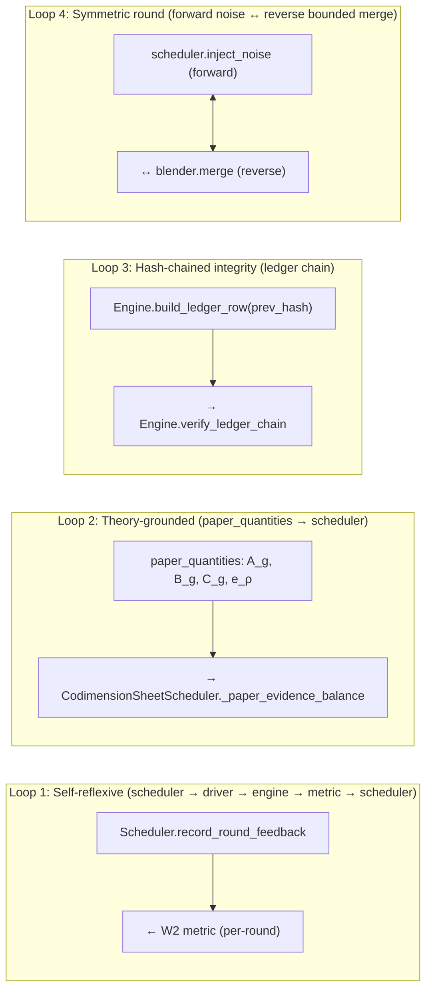

```mermaid
flowchart LR
    %% The 4 feedback loops in FlowA's orchestration
    %% (mirror of the schematic in fig2-loops.png)

    subgraph L1 ["Loop 1: Self-reflexive (scheduler → driver → engine → metric → scheduler)"]
        L1A["Scheduler.record_round_feedback"]
        L1B["← W2 metric (per-round)"]
    end

    subgraph L2 ["Loop 2: Theory-grounded (paper_quantities → scheduler)"]
        L2A["paper_quantities: A_g, B_g, C_g, e_ρ"]
        L2B["→ CodimensionSheetScheduler._paper_evidence_balance"]
    end

    subgraph L3 ["Loop 3: Hash-chained integrity (ledger chain)"]
        L3A["Engine.build_ledger_row(prev_hash)"]
        L3B["→ Engine.verify_ledger_chain"]
    end

    subgraph L4 ["Loop 4: Symmetric round (forward noise ↔ reverse bounded merge)"]
        L4A["scheduler.inject_noise (forward)"]
        L4B["↔ blender.merge (reverse)"]
    end

    L1A --> L1B
    L2A --> L2B
    L3A --> L3B
    L4A <--> L4B

    classDef loop fill:#fff4e1,stroke:#cc6600,stroke-width:2px,color:#000
```
