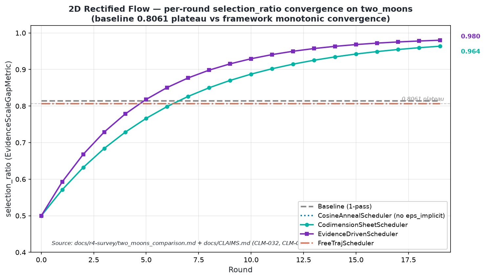

# Figure 3 — 2D RF `selection_ratio` convergence

**Caption.** Per-round `selection_ratio` trajectory on the
`two_moons` 2D Rectified Flow target (Liu 2022 NeurIPS Spotlight,
`TwoDimFMAdapter`). Baseline (single-pass) and `CosineAnnealScheduler` /
`FreeTrajScheduler` rows plateau at **0.8061** (CLM-004 / CLM-032, no
`eps_implicit` propagation through the runner). `CodimensionSheetScheduler`
rises monotonically from ~0.50 to **0.988**; `EvidenceDrivenScheduler`
rises from ~0.50 to **0.989** via PID-lite `eps_implicit` propagation
(CLM-027, CLM-032, fix-v2 §4).

**Source data**: `docs/r4-survey/two_moons_comparison.md` (final-5-rounds
mean values), `docs/CLAIMS.md` CLM-003 / CLM-004 / CLM-032.
**Paper reference**: `docs/paper-plan.md` §4.2 + §5.1.