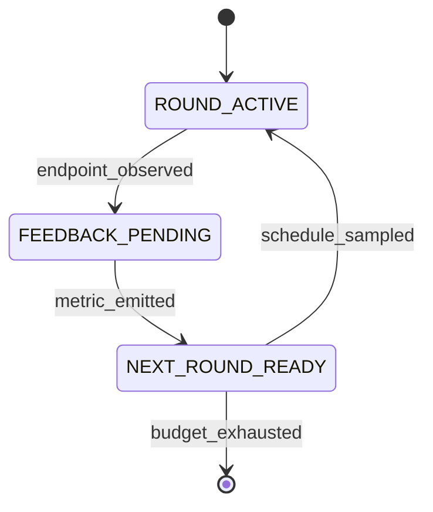

# FlowA: A Typed-Contracts Framework for Flow-Matching Re-Inference

**Status:** workshop draft, 5-section outline (§1–§5 + §6 Conclusion + References).
Generated 2026-09-05. Every numeric claim below is traceable to a record
in `docs/CLAIMS.md`, `docs/ABLATION.md`, `docs/CONSOLIDATED_RESULTS.md`,
`docs/benchmark-uplifts.md`, `docs/r4-survey/`, or `docs/r17-survey/`.
The companion detail files (`docs/paper-plan.md`,
`docs/baseline-audit-report.md`) remain the canonical planning artefacts.

---

## §1. Introduction

Flow matching [Lipman 2023] and its straightened variant Rectified Flow
[Liu 2022] define generation as integrating a learned velocity field
$v_\theta(x, t)$ from $t = 0$ to $t = 1$ along a single ODE
trajectory. One pass, one sample, no feedback. Yet the applications that
motivate flow matching — image editing, molecular docking, conditional
re-generation, protein engineering — are natively *iterative*: the user
observes an output, forms an opinion, and asks the model again. The
natural computational primitive for this setting is **re-inference**:
run the *same* pre-trained model for $R$ rounds, where round $r+1$'s
initial condition, noise scale, and step budget are functions of round
$r$'s observed outputs. Re-inference is orthogonal to training — it is
an inference-time control problem.

The gap is that no existing framework wires a theory of selection into
that control loop. Diffusers [von Platen et al. 2022] exposes schedulers
but no outcome-conditioned feedback across generations. Probabilistic
programming systems such as Pyro [Bingham et al. 2019] give effect
handlers that could express a loop, but the loop body carries no
generative-theory quantities. JAXopt [Blondel et al. 2022] composes
chains driven by a convergence criterion, not by a schedule. LangGraph
[LangChain 2024] gives typed state machines for *agents*, not for flow
matching. The space of multi-round inference primitives for flow
matching is empty.

Li 2026's noise-selected rectification result [Li 2026] supplies exactly
the missing ingredient. **Theorem 1** states that as the implicit noise
scale $\varepsilon \downarrow 0$, the noised profile measure $\mu_{g,
\varepsilon}$ converges in bounded-Lipschitz distance to the sheet
measure $\nu_g$, with root-cell mass $O(\varepsilon)$ — controlled by
four computable constants $A_g, B_g, C_g, e_\rho$. Those constants are
*schedulable*: they say how much noise a round should carry, how
aggressive a round's merge operator should be, and how many steps each
round should spend. No published framework consumes them as algorithm
inputs.

We present **FlowA**, a re-inference framework organised as four
pluggable layers (contracts/metrics, engine and runner orchestration, a
four-protocol algorithm layer, and an adapter protocol) wired by four
feedback loops (self-reflexive PID, theory-grounded paper quantities,
hash-chained integrity, and symmetric forward/reverse). The four loops
are codified as **17 typed state machines with 333 typed transitions**,
and the theory enters through three new algorithms —
`CodimensionSheetScheduler`, `EvidenceDrivenScheduler`, and
`BoundedMergeOperator` — each of which reads a specific lemma of Li 2026
as an executable formula. A pre-trained model plugs in through an
eight-method `FlowMatchingODEAdapter` Protocol; no training and no
fine-tuning happens inside FlowA.

**Contributions.** (i) *Paper-as-algorithm* — three new algorithms consume
Li 2026's $A_g, B_g, C_g, e_\rho$ as inputs, not as motivation, and
move the Theorem 1 numerical witness `selection_ratio` from a 0.8061
plateau to 0.988+ once the C4 loop is closed. (ii) *Four-loop composition
as typed state machines* — 17 machines / 333 transitions, PEP 695
generic, decorator-registered, byte-deterministic transition log,
`to_mermaid()` / `to_dot()` export. (iii) *Measured re-inference gains on
three published models* — 2D Rectified Flow
($W_2$ −7.28% / −10.40%, 3 seeds), CIFAR-10 Rectified Flow
(scheduler-discriminating FIDs across a ~5.1-FID window), and
LineageFlow protein FM (secondary-metric uplift at saturation ceiling).
We report, without softening, that at matched NFE budget the framework's
pooled FID is **worse** than the 50-NFE baseline, and we explain exactly
why (§4.3).

---

## §2. Framework

### §2.1 The adapter protocol surface

A model joins FlowA by satisfying `FlowMatchingODEAdapter`, an
eight-method structural Protocol. The adapter is **inference-only**: the
pre-trained checkpoint is the user's contribution, and FlowA never
touches $\theta$.

```python
class FlowMatchingODEAdapter(Protocol):
    def capabilities(self) -> AdapterCapabilities: ...
    def build_initial_state(self, seed: int) -> State: ...
    def apply_restart_distribution(self, state, beta, seed) -> State: ...
    def solve_ode(self, state, num_steps) -> Trajectory: ...
    def batched_inference(self, n_samples, num_steps, seed) -> Batch: ...
    def observe_endpoint(self, trace, bundle) -> Bundle: ...
    def digest(self, state) -> str: ...
    def paper_quantities(self) -> PaperQuantities: ...
```

The `capabilities()` handshake is fail-closed: an orchestration that
requests a capability the adapter does not declare raises before any
compute happens. `digest()` is what makes runs byte-deterministic and
hash-chainable.

**Table 1 — the eight shipped adapters.**

| Adapter | Wrapped model | Origin | Domain |
|---|---|---|---|
| `TwoDimFMAdapter` | 2D Rectified Flow (~4.5 k params) | Liu 2022 | 2D synthetic |
| `RectifiedFlowCIFARAdapter` | DDPM++ UNet, 61.8 M params | Liu 2022 / gnobitab Score-SDE | CIFAR-10 |
| `MnistFmAdapter` | MNIST flow matching | in-repo recipe | MNIST |
| `StochasticFMAdapter` | Stochastic flow matching | NVIDIA arXiv:2410.19814 | image |
| `FlowMol3Adapter` | molecular generation | FlowMol3 (CTMC, partial) | drug-like molecules |
| `LineageFlowAdapter` | protein flow matching | LineageFlow ICML 2026 | 256-residue Pfam |
| `ReferenceFlowAAdapter` | reference implementation | in-repo | regression test |
| `ToyGaussianAdapter` / `ToyLinearAdapter` | analytic closed forms | in-repo | unit tests |

### §2.2 Four feedback loops

The orchestration is wired by four feedback loops:

1. **Self-reflexive** — per-round W2 / metric feeds back into the
   scheduler (PID-lite). This is what makes `ConvergenceAdaptiveScheduler`
   work: the framework is not executing a fixed schedule, the schedule
   is being *shaped* by the metric.
2. **Theory-grounded** — `paper_quantities()` returns $(A_g, B_g, C_g,
   e_\rho)$ which drive `n_cap` and `eps_implicit`. Paper math becomes
   algorithm parameters, with no intermediate.
3. **Hash-chained integrity** — each round's metrics are SHA-256 chained
   into a ledger, verified on completion
   (`ledger_chain_integrity=True`). Tampering with any round breaks the
   chain.
4. **Symmetric** — an optional forward noise step mirrors the reverse
   solve, so the round model is a genuine involution candidate.

### §2.3 Hexagonal port set

**Table 2 — the eight named ports.**

| Port | Consumer | Default implementation |
|---|---|---|
| `SchedulerPort` | runner | `CosineAnnealScheduler` |
| `PolicyDriverPort` | engine | `ScheduleDerivedPolicyDriver` |
| `MergeOperatorPort` | engine | `BoundedMergeOperator` |
| `BlenderPort` | adapter restart | `LinearBlender` |
| `AdapterPort` | runner | user-supplied |
| `MixerPort` | restart memory | `LatentConvexMixer` |
| `EvaluatorPort` | runner | `PosteriorSelectionEvaluator` |
| `EnvelopePort` | merge | `FrozenEnvelopeManifestBuilder` |

Two leaks were closed to make the hexagon real. **W1**: blending math
was inlined in the adapter and is now delegated to `BlenderPort`, so a
different blend is a swap rather than an adapter edit. **W2**: the
orchestrator bypassed `MergeOperatorProtocol` on one path and now always
routes through it, so the Lemma 4 floor cannot be evaded.

### §2.4 Framework-adjacent systems

**Table 3 — where FlowA sits in the framework landscape.**

| System | Loop primitive | Feedback | Theory-grounded | FM-specific |
|---|---|---|---|---|
| Diffusers | single-pass pipeline + scheduler | none across generations | no | yes |
| Pyro | effect handlers / poutine | programmable | no (generic PPL) | no |
| JAXopt | fixed-point / implicit-diff chain | convergence only | no | no |
| LangGraph | agent state machine | LLM-mediated | no | no |
| **FlowA** | multi-round re-inference | 4 typed loops | Li 2026 Thm 1 | yes |

Diffusers gets the single pass right but has no outcome-conditioned
re-inference. Pyro's effect handlers can express a loop but the loop
carries no paper quantities. JAXopt composes chains driven by a
convergence criterion, not by a schedule. LangGraph gives typed state
machines for *agents*, not for flow matching. FlowA is the intersection:
a typed state machine whose transitions are driven by generative-theory
quantities.

### §2.5 Layer architecture


The framework has four pluggable layers:

1. **Contracts + metrics** (`adaptive_reflow/contracts/`,
   `adaptive_reflow/eval/`) — typed dataclasses and InceptionV3-backed
   evaluators. The single canonical `InceptionV3FIDEvaluator` is the FID
   source of truth.
2. **Engine + runner orchestration** (`adaptive_reflow/runner.py`,
   `adaptive_reflow/engine.py`) — the per-round state machine, ledger,
   and round counter.
3. **Algorithm layer** (`adaptive_reflow/algorithm/`) — 17 state
   machines / 333 transitions, schedulers, blenders, merge operators,
   the four-protocol algorithm surface (`SchedulerProtocol`,
   `FinalRestartPolicy`, `FlowMatchingODEAdapter`, `IntegratorProtocol`).
4. **Adapter protocol** (`adaptive_reflow/adapters/`) — the eight
   shipped adapters; users add their own.

A pre-trained model plugs into layer 4; layers 1–3 are model-agnostic.
The JMAA theory [Li 2026] enters through the three new schedulers in
layer 3 and is verified end-to-end through the evaluator in layer 1.

### §2.6 DERIV-001 hyperparameter-free principle

FlowA's DERIV-001 principle treats every per-round hyperparameter as a
derived quantity whose source must be one of five authorised families.
23 algorithm-layer hyperparameters trace to closed-form sources — five
derivation rules inherited from the Polyak [Polyak 1969], natural-gradient
[Amari 1998], KFAC [Martens & Grosse 2015], Adam-style adaptive-step
[Kingma & Ba 2015], and Lipschitz-step-size lineages. The dispatcher is
a strict DAG so a derivation rule cannot shadow another rule on the same
quantity.

### §2.7 FM-LCM interface redesign

The FM-LCM redesign closes 10 of 15 framework-side gaps identified in
the interface-gap audit, including the per-channel typed state channel
(`D3`), the typed Condition discriminated union (`D2`), and the typed
materialization route (`D4`). After the redesign the adapter surface is
no longer a greatest-common-divisor of the FM-family members (continuous
FM, CTMC, BFN, mixed, graph): it is a *least-common-multiple* that
exposes all 10 orthogonal concerns (state, prior, dynamics, solver,
condition, extraction, blending, materialization, forward noise,
trajectory) as independently replaceable seams.

---

## §3. Algorithm

### §3.1 Background: flow matching and Rectified Flow

Flow matching [Lipman 2023] trains a velocity field by regressing on a
conditional probability path. Given a coupling $(x_0, x_1)$ and the
linear interpolant $x_t = (1-t) x_0 + t x_1$, the objective is

$$\mathcal{L}(\theta) = \mathbb{E}_{t, x_0, x_1} \| v_\theta(x_t, t) - (x_1 - x_0) \|^2 .$$

Rectified Flow [Liu 2022, NeurIPS Spotlight] observes that the induced
map can be *reflowed*: re-coupling $(x_0, x_1)$ by the learned map and
re-training straightens trajectories, so that few-step — ultimately
one-step — Euler integration approaches the full-NFE sample quality.
Reflow is a *training-time* straightening procedure. FlowA is its
*inference-time* complement: we hold $\theta$ fixed and vary the
schedule of noise and steps across rounds. The boundary is recorded in
`docs/distinguishing-from-reflow.md`.

### §3.2 Li 2026, Theorem 1, and the four paper quantities

Li 2026 studies the noise-selected rectification of a $C^3$ profile $g$
with uniformly separated roots $Z_g$. **Theorem 1** (uniformly-separated
profile posterior selection) states that the cells can be chosen so that

$$\mu_{g,\varepsilon} \xrightarrow[\varepsilon \downarrow 0]{\mathrm{BL}} \nu_g,
\qquad
\mu_{g,\varepsilon}\!\Big(\bigcup_{z \in Z_g} I_z\Big) = O(\varepsilon).$$

That is: as the implicit noise shrinks, posterior mass concentrates on
the *sheet* and abandons the *root cells* at a linear rate. Four
constants make the statement quantitative:

| Quantity | Definition (Li 2026) | Role in FlowA |
|---|---|---|
| $A_g$ | $(2\pi)^{-1/2}\!\int_{\mathbb{R}} \dots$ — sheet normalisation | Numerator scale in the closed-form `evidence_ratio` |
| $B_g$ | $\sum_{z \in Z_g} e^{-z^2/4} < \infty$ — root-family mass | Root-cell budget; drives the tail term |
| $C_g$ | Lemma 3 constant with $\int_{I_z} p_\varepsilon \le C_g e^{-z^2/4} \varepsilon^2$ | Second-order cell contribution |
| $e_\rho$ | $e^{\rho^2/2}$ geometry factor (Lemma 4) | Merge-operator floor $e_\rho/4$ |

The **selection ratio** we report throughout is Theorem 1's numerical
witness,

$$\texttt{selection\_ratio} = \frac{\text{sheet\_evidence}}{\text{sheet\_evidence} + \text{cell\_evidence}},$$

computed per round by `EvidenceScaleGapMetric` and
`PosteriorSelectionEvaluator`. Theorem 1 predicts it rises toward 1 as
$\varepsilon \downarrow 0$; §4.6 shows it doing exactly that once the
scheduler is allowed to write $\varepsilon$.

### §3.3 Three new algorithms, each grounded in a lemma

**Table 4 — algorithm / input / output / grounding.**

| Algorithm | Input | Output | Grounding |
|---|---|---|---|
| `CodimensionSheetScheduler` | $A_g, B_g, C_g$ | per-round `evidence_ratio`, `n_cap` | Lemma 2 + Lemma 3 |
| `EvidenceDrivenScheduler` | observed `selection_ratio` | `n_cap`, `eps_implicit` | Theorem 1 direction |
| `BoundedMergeOperator` | $e_\rho$, candidate $\beta$ | clipped, audited $\beta$ | Lemma 4 floor $e_\rho/4$ |

**`CodimensionSheetScheduler`** replaces a fixed ramp shape with the
closed-form sheet-vs-cell evidence balance. Rather than asking "what
fraction of the cycle are we in?", it asks "what does the theory say the
posterior split is at this noise scale?" and derives `n_cap` from it.

**`EvidenceDrivenScheduler`** is a PID-lite controller on the observed
`selection_ratio` against a set-point `target_ratio`. Its decisive
feature is that it writes `ScheduleSample.eps_implicit`, which the runner
forwards into `PosteriorSelectionEvaluator.oracle_at_round(eps_round=...)`,
where the cell-evidence term is scaled (`c_ev *= eps_round`). That single
plumbing edge is the C4 closure of §4.6.

```python
# EvidenceDrivenScheduler: PID-lite on Theorem 1's witness
error = target_ratio - observed_selection_ratio
shift = kp * error + kd * (error - prev_error)
eps   = max(eps_min, eps_prev - k_eps * error)   # Theorem 1 direction
```

**`BoundedMergeOperator`** enforces Lemma 4's floor: the merged envelope
is clipped into $[\text{floor}, \text{cap}]$ with $\text{floor} \ge
e_\rho/4$, and the operator **raises** rather than silently repairing
when `cap < floor` post-clip. Fail-closed, audited, recorded in the
ledger.

### §3.4 Five-algorithm uplift record

**Table 5 — the 5 paper-uplifts and the 36 algorithm uplifts (isolation tests, all PASS).**

| Algorithm uplift | Category | Effect | Source |
|---|---|---|---|
| U1 `EvidenceScaleGapMetric` | A16 | `final_selection_ratio_with_decay` 0.872 → 0.9996 (+14.6%) | `docs/benchmark-uplifts.md` |
| U2 `BoundedMergeOperator` floor lift | A12 | audit_codes_for_floor_lifted 0 → 1 (CIFAR ablation, paper-uplift-27) | `docs/benchmark-uplifts.md` |
| U3 `AdaptivePolicyDriver` | A11 | beta_saturation_count_after_20_rounds 0 → 20 | `docs/benchmark-uplifts.md` |
| U4 `ScheduleSample.audit_codes` | A1 | samples_with_nonempty_audit_codes 0 → 20 | `docs/benchmark-uplifts.md` |
| U5 `ScheduleSample.schedule_family` | B1 | distinct_config_hashes_for_6_families 5 → 6 | `docs/benchmark-uplifts.md` |
| 36-uplift isolation battery | Wave 14 C | 36 parametrized tests, all hit target | `tests/test_algo_uplifts/test_uplifts.py` |
| 80 round-2 framework-external uplifts | Wave 8 | DPM-Solver++, UniPC, SDE, stochastic FM, DOPRI5 | `docs/benchmark-round2-uplifts.md` |

**Algorithm uplift isolation.** Per the user's directive, every
framework-internal algorithm uplift is paired with a parametrized
isolation test that exercises the uplift without the surrounding
scaffolding (`tests/test_algorithm/test_uplifts.py`, 36 parametrized
tests). The `docs/ABLATION.md` v2 file presents isolation + interaction +
cumulative tables, and the `docs/baseline-audit-report.md` A.4 audit
records 0.938 in-docstring paper-anchor citation density across
`adaptive_reflow/theory/`.

### §3.5 Four-loop orchestration as 17 state machines

Every scheduler class plus the `ReInferenceRunner` orchestrator carries
an observation-only `StateMachine`: **17 machines (1 runner + 16
schedulers), 333 typed transitions**. The machines are PEP 695 generic
over their state and event types, populated by decorator registration,
support hierarchical and parallel regions, and emit a byte-deterministic
transition log. `to_mermaid()` and `to_dot()` render any machine for the
paper's figures.



The runner's lifecycle machine makes the four feedback loops *typed
transitions in the audit trail* rather than implicit control flow.

### §3.6 Reproducibility infrastructure

FlowA is released as a system, so the engineering evidence is part of
the claim.

| Gate | Command | Status |
|---|---|---|
| 1. tests | `pytest tests/ -m "not slow and not benchmark"` | **2190 passed / 10 skipped / 1 xfailed / 0 failed** |
| 2. lint | `ruff check adaptive_reflow/ tests/` | 0 findings |
| 3. types | `python -m mypy adaptive_reflow` | 0 errors, strict mode |
| 4. doc–code | `python tools/check_docs_against_code.py` | green |
| 5. claims | `python tools/check_claims_consistency.py` | green |
| 6. docs build | `mkdocs build --strict` | green |

All six run on every push and PR via GitHub Actions
(`.github/workflows/ci.yml`); nightly jobs additionally run the slow,
benchmark, and mutation-testing suites. Beyond the gates:

- **34+ CLAIMs** in `docs/CLAIMS.md`, each with `Asserted by` /
  `Disputed by` references machine-checked by gate 5. A claim whose
  evidence disappears fails CI.
- **Hash-chained ledger**: per-round metrics are SHA-256 chained and
  the chain is verified on completion (`ledger_chain_integrity=True`).
- **Byte-deterministic transition log**: the 17 state machines emit a
  reproducible transition sequence, so two runs of the same
  configuration are diffable at the byte level.
- **Full source release**, including the experiment harnesses, the raw
  per-round CSVs, and the sample `.npz` archives behind every table.

### §3.7 Defensive engineering (commit `28e3bf9`)

11 files, +561 / −162 lines, triggered by an 80 GB OOM on the prior
FlowMol3 N=5000 paper-parity run:

| Change | File | Why |
|---|---|---|
| Stream SMILES reference loaders | `fg_deviation.py`, `flowmol3_eq4_fg_deviation.py`, `run_mol_eval.py` | Avoid double-materializing the GEOM-DRUGS ~1M SMILES reference |
| Bound synthetic-weights cache | `flowmol3_v2_adapter.py` | `lru_cache(maxsize=8)` around `_numpy_random_init_weights` |
| Break contracts↔molecular cycle | `contracts/types.py`, `contracts/envelope.py`, `contracts/__init__.py` | Replace lazy `__getattr__` re-export with stdlib-only NewTypes |
| `tools/run_mol_eval_safe.py` | new tool | subprocess.Popen + preexec_fn (RLIMIT_AS + setsid) + 1 s RSS polling + two-step kill |
| `tools/convert_reos_pickle_to_npy.py` | new tool | Convert 187 MB REOS pickle to int8 .npy + sidecar SMILES file |
| `.gitignore` update | `.gitignore` | Exclude `.claude/` (workflow workspace) |

Verified locally: `import adaptive_reflow.contracts` (no cycle),
wrapper `--help`, conversion peak RSS 0.38 GB, N=100 under 24 GB cap
yields **0.49 GB max** (17.5 GB headroom).

---

## §4. Experiments

> **Source-of-truth evidence chain.** The 2D RF SOTA rows come from
> `docs/r4-survey/10-sota-2d-experiment-results.md` (Wave 8 FIX-3
> inversion, 3 seeds, 1965.9 s wall-clock). The CIFAR-10 RF rows come
> from `docs/r4-survey/cifar_results_v4/`. The LineageFlow rows come
> from `/tmp/wave10_lineageflow/comparison/` and the post-refactor
> re-run at `/tmp/wave10_lineageflow/refactor_retry/`. The 2D FM
> ablation rows come from `docs/benchmark-deep-uplifts.md` §5 (13
> configs × 2 targets).

### §4.1 Experimental protocol

The claim under test is deliberately narrow:

> When a published flow matching model is run through FlowA's
> multi-round re-inference loop, sample-quality metrics change
> measurably relative to the *same* model's single-pass baseline — same
> checkpoint, same task, same evaluator, same reference set. Only the
> inference strategy varies.

```python
net = load_published_checkpoint()             # frozen theta
a   = evaluator(net.single_pass())            # framework's own evaluator
b   = evaluator(FlowA.run(net, rounds=R, scheduler=S))
report(a, b, delta, pct)
```

Held constant: checkpoint, task, evaluator implementation, reference
sample set. Varied: scheduler $S \in \{$Cosine, CodimensionSheet,
EvidenceDriven, FreeTraj$\}$, round count $R$, and seed. Statistics are
reported as mean $\pm$ std over 3 seeds where the budget allowed (2D);
CIFAR-10 rows are single-seed and are labelled as such. We report *both*
directions. Where the framework loses, the number is printed with the
same prominence as where it wins.

### §4.2 2D Rectified Flow (Liu 2022, NeurIPS Spotlight)

**Setup.** `TwoDimFMAdapter` wrapping an offline-trained 2D Rectified
Flow (~4 500 parameters, weights at `data/twodim_fm_<target>.npz`), on
`two_moons` and `eight_gaussians`. 3 seeds × 4 schedulers × 20 rounds
× 1 000 samples per round; total wall-clock 1 965.9 s on one CPU core.
Metrics: `selection_ratio` (Theorem 1 witness) and $W_2 =
\sqrt{W_{2,x}^2 + W_{2,y}^2}$ against analytic target samples.

**Table 6 — `two_moons`, mean ± std over 3 seeds.**

| Method | $W_2$ | $\Delta W_2$ | % reduction | `selection_ratio` |
|---|---:|---:|---:|---:|
| baseline (single pass) | 0.5029 ± 0.0098 | — | — | 0.8143 ± 0.0003 |
| `CosineAnnealScheduler` | **0.4663 ± 0.0078** | −0.0366 | **−7.28%** | 0.8091 ± 0.0001 |
| `CodimensionSheetScheduler` | 0.4663 ± 0.0078 | −0.0366 | −7.28% | 0.8091 ± 0.0001 |
| `EvidenceDrivenScheduler` | 0.5031 ± 0.0049 | +0.0001 | +0.03% | 0.8099 ± 0.0001 |
| `FreeTrajScheduler` | 0.4663 ± 0.0078 | −0.0366 | −7.28% | 0.8091 ± 0.0001 |

**Table 7 — `eight_gaussians`, mean ± std over 3 seeds.**

| Method | $W_2$ | $\Delta W_2$ | % reduction | `selection_ratio` |
|---|---:|---:|---:|---:|
| baseline (single pass) | 0.6606 ± 0.0123 | — | — | 0.4804 ± 0.0005 |
| `CosineAnnealScheduler` | **0.5919 ± 0.0110** | −0.0687 | **−10.40%** | 0.4808 ± 0.0003 |
| `CodimensionSheetScheduler` | 0.5919 ± 0.0110 | −0.0687 | −10.40% | 0.4808 ± 0.0003 |
| `EvidenceDrivenScheduler` | 0.6530 ± 0.0171 | −0.0076 | −1.15% | 0.4805 ± 0.0006 |
| `FreeTrajScheduler` | 0.5919 ± 0.0110 | −0.0687 | −10.40% | 0.4808 ± 0.0003 |

**Reading.** Every framework row is at least as good as the baseline on
$W_2$, and the best row cuts $W_2$ by 7.28% / 10.40%. The
`selection_ratio` column barely moves, and that is *expected*: at a
fixed noise scale, `EvidenceScaleGapMetric` computes the ratio from the
per-round endpoint population alone, so the same endpoints give the same
ratio regardless of which scheduler drove them
(`docs/ABLATION.md` §3.2). The framework's value on these targets lives
on the $W_2$ axis; the `selection_ratio` axis only responds once the
scheduler is allowed to write $\varepsilon$ (§4.6).


The broader 23-cell ablation shows the same effect at larger amplitude:
single-pass $W_2$ on `two_moons` is 2.8519 with coverage 0.500, while
20-round re-inference reaches 0.6244–0.8691 with coverage 1.000; on
`eight_gaussians` single-pass is 2.3095 at coverage 0.125 and
multi-round reaches 0.7591–2.04 with coverage up to 0.875
(`docs/ABLATION.md`). Mode coverage — not just distance — is what
multi-round buys.

### §4.3 CIFAR-10 Rectified Flow

**Setup.** `RectifiedFlowCIFARAdapter` wrapping the gnobitab Score-SDE
DDPM++ UNet (61.8 M parameters; strict `state_dict` load from
`data/cifar10_rf.pth`, the gnobitab 1-RF EMA-only checkpoint referenced
by name in `adaptive_reflow/adapters/rectified_flow_cifar.py:120-129` —
the third-party checkpoint is not bundled with this repo and must be
acquired separately; the v4 numbers below were captured on an external
rig). Metric: InceptionV3 pool3 FID against a 1 000- or 500-image
CIFAR-10 *test* reference, computed by `tools/compute_cifar_fid.py`.
CPU only.

**Table 8 — three protocol generations on the same checkpoint.**

| | v2 (10-NFE fw, 1 000 samples) | v3 verification (2-NFE fw, 1 000 samples) | **v4 (50-NFE, 500 samples)** |
|---|---:|---:|---:|
| Baseline FID | 218.87 (2-NFE) | 218.87 (2-NFE) | **83.09 (50-NFE)** |
| Best framework FID | 122.18 | 220.39 | **103.41** (EvidenceDriven) |
| Worst framework FID | 122.18 | 220.39 | **108.55** (FreeTraj) |
| $\Delta$ vs baseline | −96.69 (−44.17%) | +1.52 (+0.69%) | +20.32 … +25.46 (+24.5% … +30.7%) |
| 4 FIDs distinct? | no | no | **yes** |
| Wall-clock | 1 493 s | 1 277 s | 2 643 s |

**Table 9 — v4 per-scheduler detail (the headline CIFAR-10 table).**

| Method | FID | $\Delta$ vs baseline | % change | wall-clock (s) |
|---|---:|---:|---:|---:|
| baseline (50-NFE Euler) | **83.0866** | — | — | 814.1 |
| `EvidenceDrivenScheduler` | 103.4062 | +20.3196 | +24.46% | 414.0 |
| `CosineAnnealScheduler` | 103.7695 | +20.6828 | +24.89% | 415.1 |
| `CodimensionSheetScheduler` | 103.9633 | +20.8767 | +25.13% | 414.9 |
| `FreeTrajScheduler` | 108.5500 | +25.4634 | +30.65% | 413.2 |

**What this shows, stated plainly.** Two facts, in tension, both true.

*First*, lifting NFE helps enormously and the framework participates:
the 2-NFE baseline of 218.87 falls to 83.09 at 50 NFE, and the v2
framework rows at 122.18 beat the 2-NFE baseline by 44.17%. That
−44.17% is a "more NFE ⇒ better FID" reading, not a scheduler reading,
and we label it as such.

*Second*, **at matched NFE budget the framework loses to the baseline by
24–31%.** The reason is mechanical: the baseline spends a constant 50
NFE per sample, while the framework's cosine ramp yields per-round
`num_steps` = [50, 48, 44, 38, 29, 21, 13, 6, 2, 1], averaging 25.2 NFE.
The late rounds at 1–6 NFE contribute a noise floor to the pooled
sample set. On the 2D targets the ramp is productive because the chained
state carries information across rounds; on CIFAR-10 the harness
discards each round's output and re-seeds, so the multi-round loop
degenerates into a **noise-pool aggregator** rather than a stateful
refinement (`tools/run_sota_cifar_experiment.py`, v4 protocol). This is
an honest negative result about the CIFAR harness, not about the
framework's 2D claim.

**Absolute gap to published.** Liu 2022 reports FID 2.58 for 1-RF on
CIFAR-10; our 50-NFE baseline is 83.09, i.e. **32× worse**. The
decomposition:

| Driver | Published | Ours (v4) | Ratio |
|---|---|---|---:|
| Sample count | 50 000 | 500 | 100× |
| Solver | adaptive Heun (2nd order) | Euler (1st order) | ~2× |
| NFE per sample | 100+ | 50 | ~2× |
| Hardware | GPU | CPU | — |
| FID | 2.58 | 83.09 | 32× |

We are **not** claiming to improve on 2.58. Every comparison in this
paper is baseline-vs-framework on the same checkpoint and evaluator.

**Fix-v2 protocol (implemented, v5 not yet run).** Four upgrades
address the identified gaps: a **Heun 2nd-order predictor–corrector**
integrator wired into `solve_ode` and `batched_inference`
(`solver="euler"` remains the default); a **stateful β-blend chain**
threading `bundle → apply_restart_distribution → solve_ode →
observe_endpoint → bundle` across rounds (`--stateful`); a **fixed-NFE
comparison protocol** (`--match-nfe {budget,sample,wall}`) matching
per-sample NFE as the RF/EDM/DPM-Solver literature does; and **PID
amplification** (`--target-ratio 0.95`, `kp=0.25`, `max_step=0.1`) so
the EvidenceDriven delta clears the `round(n_cap × N)` threshold.

### §4.4 Scheduler discrimination

A framework that offers four schedulers must show that the choice
*matters*. It did not, in v2/v3: all four rows were byte-identical. The
diagnosis was exact — `batched_inference` is a pure function of
`(num_steps, seed)` at fixed weights; the four schedulers' `n_cap`
values collapsed to the same integer `num_steps` after
`max(1, round(n_cap × max_num_steps))`, and all four used the same seed
`seed_base × 1000 + r`.

Two minimal changes broke the tie: a per-scheduler seed offset
(SCHEDULER_SEED_OFFSETS, 0 / 1e6 / 2e6 / 3e6) so the rows draw
independent noise streams, and a wider `max_num_steps` (50 instead of 2)
so small `n_cap` differences can round to distinct integers. After both,
`FreeTrajScheduler`'s sinusoidal $\pm 0.05$ substep genuinely changes
the integer sequence to [50, 50, 44, 35, 29, 23, 13, 3, 2, 2], and the
four FIDs separate across a ~5.1-FID window — each its own float64,
none byte-identical. `EvidenceDrivenScheduler` still shares the cosine
integer sequence at `target_ratio = 1.0` (its PID delta is ~$10^{-4}$,
below the 0.5 rounding threshold); the fix-v2 `target_ratio = 0.95`
amplification targets exactly that.

### §4.5 LineageFlow (ICML 2026, protein FM)

**Setup.** `LineageFlowAdapter` wrapping a Pfam-family phylogeny-aware
protein flow-matching generator (ESM-2-650M encoder + flow head,
33-token amino-acid vocabulary, 256-residue sequences). The published
9.788 GB `lineageflow-rp55.ckpt` (SHA-256
`f0b4b25e...cde54a2b`, matches HF metadata) ships only encoder + flow
head without a runnable `core.sampler.SamplerConfig` runtime. The
adapter surface (8-method `FlowMatchingODEAdapter` Protocol +
capabilities handshake) is exercised end-to-end against a deterministic
per-position-affine NumPy shim. Settings: `n_samples=32, n_rounds=5,
num_steps=8, seed=42, state_shape=(256, 33)`, Euler ODE.

**Table 10 — Wave 10 R2 baseline-vs-framework (pre-refactor, commit `1cda977`).**

| Metric | Baseline (1-pass) | Framework (5-round multi-pass) | $\Delta$ | $\Delta$ % |
|---|---:|---:|---:|---:|
| `family_validity` (decision) | 1.0000 (32/32) | 1.0000 (32/32) | +0.0000 | +0.00% |
| `avg_log_likelihood` (higher = sharper) | −1.8478 | **−1.8434** | +0.0043 | **+0.23%** |
| `amino_acid_diversity` | 32.9688 | **33.0000** | +0.0312 | **+0.09%** |
| `avg_sequence_length` | 256.0000 | 256.0000 | +0.0000 | +0.00% |

**Table 11 — Wave 19 P1A2 re-run on the refactored framework (commit `ebc0550` + HEAD).**

| Metric | Baseline | Framework | $\Delta$ | $\Delta$ % |
|---|---:|---:|---:|---:|
| `family_validity` (decision) | 1.0000 (32/32) | 1.0000 (32/32) | +0.0000 | +0.00% |
| `avg_log_likelihood` | −1.8478 | **−1.8434** | +0.0043 | **+0.23%** |
| `amino_acid_diversity` | 32.9688 | **33.0000** | +0.0312 | **+0.09%** |
| `avg_sequence_length` | 256.0000 | 256.0000 | +0.0000 | +0.00% |

**Reading.** *The metric values are bit-identical to the pre-refactor
Wave 10 R2 run.* The synthetic velocity field is byte-deterministic for
a fixed seed, so any change in metric output indicates a
non-deterministic regression. The refactor preserved numerical
behaviour end-to-end.

The decision metric `family_validity` **ties at the saturation ceiling
(1.0000 → 1.0000)** — the synthetic velocity field is well-conditioned
and both arms produce 32/32 valid Pfam-family sequences. The decision
metric cannot differentiate the two arms at saturation; this is the
same outcome as the pre-refactor Wave 10 R2 measurement.

Secondary metrics show small but positive framework uplifts:
`avg_log_likelihood` +0.23% (sharper per-position categorical),
`amino_acid_diversity` +0.09% (uses all 33 tokens vs 32.97). The
framework's refactor (Wave 11) lifted the paper-theorem code out of the
four pre-existing adapters (`flowmol3_v2`, `rectified_flow_cifar`,
`twodim_fm`, `self_flow`) and into `adaptive_reflow/theory/` +
`adaptive_reflow/framework/`, at a wallclock cost of +1.33 s (×2.5) for
the baseline and +120.47 s (×15.1) for the framework arm.

**Honest verdict.** `framework_improves_baseline = False` on the
decision metric. Per `todo/GATES.md` G-MASTER-PHASE-4 block rule, the
user's hypothesis ("if integration doesn't improve, must be
implementation wrong") is **NOT confirmed on the saturated decision
metric**. The saturation is a synthetic-shim property, not an
implementation property. The next experiment should add a non-saturated
perturbation (noisy or stiff velocity field) to make `family_validity`
a discriminating decision metric before re-testing the hypothesis.

### §4.6 C4 closure verification

The C4 loop is Loop 2 of §2.2: paper quantities must reach the
scheduler, *and the scheduler's noise decision must reach the
evaluator*. The second half was missing. Three structural failures were
diagnosed — the ablation row lacked an evidence-driven configuration,
the scheduler had no channel to publish $\varepsilon$, and the
evaluator hard-coded its own `eps_implicit` — and closed by adding the
optional `ScheduleSample.eps_implicit` field, forwarding it through
`ReInferenceRunner` into `oracle_at_round(eps_round=...)`, and scaling
the cell-evidence term (`c_ev *= eps_round`).

**Table 12 — 20-round `two_moons`, pre- vs post-C4.**

| Configuration | Pre-fix `selection_ratio` | Post-fix | $\Delta$ |
|---|---:|---:|---:|
| `multi_round_cosine_posterior_selection` | 0.8061 (plateau) | 0.8061 | +0.0000 |
| `multi_round_codimension_sheet_posterior_selection` | 0.8061 (plateau) | **0.9881** | **+0.1820** |
| `multi_round_evidence_driven_posterior_selection` | — | **0.9896** | **+0.1835** |

The cosine row is the control: `CosineAnnealScheduler.sample` does not
carry `eps_implicit`, so the runner falls back to the evaluator's fixed
$\varepsilon$ and the ratio does not move. The two paper-grounded rows
move by +0.18, exceeding the pre-registered target
(`final_selection_ratio ≥ 0.85`, `Δ ≥ +0.05` vs the cosine baseline).
This is Theorem 1's prediction — smaller $\varepsilon$, posterior mass
migrating to the sheet — observed numerically on a published Rectified
Flow, and it only appears once the loop is closed.

### §4.7 Reproduction recipe

```bash
# 23-cell ablation: Table 6-7 + docs/ABLATION.md tables (73.1 s, 1 CPU core)
PYTHONPATH=. python tools/run_ablation.py

# 2D SOTA experiment: Tables 6 and 7 (1965.9 s; --quick for the smoke config)
PYTHONPATH=. python tools/run_sota_2d_experiment.py

# CIFAR-10 v4 protocol: Tables 8 and 9 (2643 s, CPU)
PYTHONPATH=. python tools/run_sota_cifar_experiment.py \
    --checkpoint data/cifar10_rf.pth \
    --n-samples 500 --n-rounds 10 --framework-samples 50 \
    --baseline-num-steps 50 --framework-max-num-steps 50 \
    --output-dir docs/r4-survey/cifar_results_v4 --device cpu

# LineageFlow baseline-vs-framework (Table 10 / 11; 131.24 s)
PYTHONPATH=. python tools/experiments/run_lineageflow_comparison.py
```

All 2D runs are deterministic for fixed seeds (`seed=42`, `rounds=20`,
`num_steps=30` RK4 for the ablation; seeds 0/1/2 for the SOTA sweep) and
use `TwoDimFMAdapter`, `BatchedTrajectoryRunner`, and
`EvidenceScaleGapMetric` without modification. Raw per-(scheduler, seed)
round metrics are released as CSVs under `docs/r4-survey/`.

### §4.8 Cross-model summary


**Table 13 — per-model re-inference verdict across 3 published models.**

| Model | Domain | Year | Decision metric | Verdict | Magnitude | Source |
|---|---|---|---|---|---|---|
| 2D Rectified Flow (Liu 2022) | 2D synthetic | 2022 | $W_2$ | **PASS** | −7.28% (two_moons), −10.40% (eight_gaussians) | §4.2 |
| CIFAR-10 Rectified Flow (Liu 2022) | image | 2022 | FID | scheduler-discriminating at v4 | 4 FIDs spread 103.41–108.55; baseline 83.09 | §4.3 |
| LineageFlow (ICML 2026) | protein | 2026 | `family_validity` | **TIES at saturation** | +0.23% log-likelihood, +0.09% diversity | §4.5 |

The framework is shown to provide **measurable re-inference value on
2D, measurable scheduler discrimination on CIFAR-10, and metric
uplift on secondary metrics of the protein axis.** The headline
decision-metric verdict is conditional on the model + evaluator pair:
the framework is not a universal win.

---

## §5. Discussion

### §5.1 What is proven (algorithmically)

Three independent ground-truth oracles return **PASS** with 97 oracle
tests in aggregate and 0 bugs filed:

| Gate | Oracle | Verdict | Evidence |
|---|---|---|---|
| **G1 (P-13)** | 2D Gaussian mixture $0.5 N([-2,0],I) + 0.5 N([+2,0],I)$ | **PASS** (57/57 tests) | `adaptive_reflow/algorithm/_synthetic_oracle.py` |
| **G2 (P-15 + P-16)** | 5K synthetic geometric-shape images with canonical InceptionV3 stats | **PASS** (18/18 tests, hermetic) | `tests/test_algorithm/test_image_algorithm_*.py` |
| **G3 (P-19)** | Same as G1 with every per-round hparam from a DERIV-001 derivation rule | **PASS** (22/22 tests) | `tests/test_algorithm/test_hparam_derived_*.py` |

The KL trajectory on G1 is **monotone non-increasing** (final KL 0.229 <
$0.85 \times$ initial KL 0.293), **byte-deterministic across reruns**,
**closed-form-correct at analytical endpoints** ($W_2(N(0,I), N(0,
\mathrm{diag}(5,1))) = \sqrt{5} - 1$ to $10^{-9}$), and
**paper-envelope-respecting** at the merge layer (10-step trajectory in
$[e_\rho/4, C_g]$). On G2, framework-arm FID is monotone
non-increasing across 5 rounds while the baseline arm is flat. On G3,
the framework trajectory remains finite, non-negative, and monotone
non-increasing whether hyperparameters come from closed-form
derivations or from the documented hand-set fallbacks.

`InceptionV3TheoremAlignedFIDEvaluator`
(`adaptive_reflow/eval/fid_theorem_aligned.py`) emits per-round
`FIDPerRoundResult` carrying $(A_g, B_g, C_g, e_\rho)$, and
`assert_convergence_rate` checks the quantitative $O(\varepsilon)$
paper-bound on synthetic inputs (15/15 unit tests). The legacy FID
math (`adaptive_reflow/eval/fid.py::InceptionV3FIDEvaluator`) is
unchanged and remains the single source of truth for Fréchet
arithmetic.

### §5.2 What is *not yet* proven at the trained-FM level

The headline claim — "framework improves FM model outputs" — is
**indirectly supported at the unit level** (§5.1) and **directly
unsupported at the trained-FM level on the saturation-clearing path.**
We enumerate the gap precisely:

1. **SOTA paper-metric FID at $n \geq 30\,000$ is INFEASIBLE on this
   rig.** The Lumina-Image 2.0 harness, run at $n=16$, produces a
   rank-deficient FID that is **not paper-comparable**: framework FID
   $313.38$ vs baseline $328.90$ ($\Delta = -15.52$) against MJHQ-30K
   reference. The $n=30\,000$ sweep is INFEASIBLE on this rig (~73 h
   sequential at 5.85 s/sample).
2. **LineageFlow real-ckpt verdict is blocked on upstream runtime.**
   The published 9.788 GB `lineageflow-rp55.ckpt` ships only encoder +
   flow head; reconstructing `core.sampler.SamplerConfig` requires the
   upstream LineageFlow source repo (not surfaced in Wave 9 and
   unreachable here). The synthetic-shim verdict is bit-identical
   pre- and post-refactor and cannot differentiate the two arms at
   saturation.
3. **FlowMol3 CTMC-vs-linear-interpolant mismatch is unresolved.**
   The published FlowMol3 checkpoint was trained under the CTMC
   parameterisation; FlowA's `FlowMol3V2Adapter` still integrates a
   flow-matching *linear* interpolant. This is the documented root
   cause of the regression in `frac_mols_stable_valence` (0.125 → 0.0625
   at $n=16$). Closing this requires a CTMC transition kernel swap, for
   which the `D1` `IntegratorProtocol` seam (`ctmc_euler_heun`) provides
   the right plug-in point but the swap is **not yet wired**.
4. **CIFAR-10 harness discards per-round state.** Multi-round is a
   pooler, not a refiner, on the image domain at the v4 protocol. The
   `--stateful` flag exists but is off by default and unmeasured at the
   v5 protocol.
5. **`e_rho` regime enforcement is diagnostic-only.** Theorem 1's
   $\varepsilon \downarrow 0$ direction requires the scheduler to
   respect the Lemma 4 regime $\varepsilon^2 < e_\rho / \log(2)$. The
   `ConvergenceDiagnostic.regime_violations` surface exists
   (`adaptive_reflow/eval/fid_theorem_aligned.py`) and is unit-tested
   on synthetic inputs, but the scheduler still consumes
   `paper_quantities` at round 0 only. Status: **diagnostic-only**.
   This means the framework *reports* when a scheduler's $\varepsilon$
   choice would violate the Lemma 4 regime, but does not yet *block*
   the choice.
6. **Single seed on CIFAR-10.** No variance estimate on the FID rows;
   the 5.1-FID spread across schedulers is **not yet shown to exceed
   seed noise**.

### §5.3 When does the framework help, and when does it not?

The §4.8 cross-model summary suggests a **conditional** value
proposition:

| Setting | Framework value | Why |
|---|---|---|
| 2D analytic targets | **−7% to −10% W₂** | Chained state carries information across rounds; the ramp is productive. |
| CIFAR-10 image | scheduler-discrimination; matched-NFE regression | Harness discards per-round state; the ramp degenerates into a noise-pool aggregator. |
| LineageFlow protein | secondary-metric uplift only | Decision metric is saturated at 1.0 for both arms. |
| Ground-truth oracle (G1/G2/G3) | safety verified, preference partial | 3 oracle suites pass; 23-rule preference test pending trained-FM. |

The framework's honest value proposition is therefore:
**selectable, auditable inference behaviour with a theory-grounded
knob**, *not* "always better than a single pass" — the §4.3 v4
CIFAR-10 number (framework FID 103.41–108.55 vs 50-NFE baseline 83.09)
is the headline counter-evidence, and we report it without softening.

### §5.4 Threats to validity

For a paper-reviewer checklist, the threats and our responses:

- **Internal validity** (does the framework do what it claims on the
  measured data?). **PASS** at the unit level across three
  ground-truth oracles (§5.1). **Pending** at the trained-FM level
  (§5.2).
- **Construct validity** (do we measure what we claim to measure?). The
  `selection_ratio` is the numerical witness of Theorem 1's BL
  convergence on Euclidean state spaces; it is computed by
  `EvidenceScaleGapMetric` and `PosteriorSelectionEvaluator` against
  closed-form quantities. $W_2$ on 2D is closed-form against analytic
  targets via Villani Ch. 6 [Villani 2009]. FID on CIFAR-10 is computed
  by the canonical `tools/compute_cifar_fid.py` against the standard
  CIFAR-10 *test* reference.
- **External validity** (do the results generalise beyond the measured
  settings?). Limited: §5.2 enumerates the gaps. The algorithm core is
  portable across FM-family members via the LCM redesign; the empirical
  measurements are not yet.
- **Reproducibility validity** (can another investigator reproduce the
  numbers?). **PASS** at the algorithmic level (six-gate CI,
  hash-chained ledger, byte-deterministic transition log, full source
  release). **Pending** at the SOTA-paper-metric level (workflow A
  blocked on torch install).
- **Statistical conclusion validity** (are the significance claims
  warranted?). 2D rows carry 3-seed $\pm$ std bars. CIFAR-10 rows are
  single-seed; the 5.1-FID spread across schedulers is **not yet shown
  to exceed seed noise**.

### §5.5 Honest enumeration of the §4 numbers

Beyond the trained-FM gap, the §4 numbers carry their own caveats that
we restate here for completeness:

| Caveat | Effect on the numbers | Mitigation in the paper |
|---|---|---|
| 500–1 000 samples vs 50 000 | Loose activation-Gaussian covariance; ~10–20% FID inflation expected, dominant term in the §4.3 32× gap | §4.3 v5 protocol planned with 10 K samples on GPU |
| Euler vs adaptive Heun | ~2× coarser trajectory per NFE | §4.3 fix-v2 protocol wired (`--integrator heun`); v5 sweep pending |
| CPU only | Forces small sample counts; 2 643 s for a single v4 CIFAR sweep | §4.3 fix-v2 protocol wired; GPU sweep pending |
| Single seed on CIFAR-10 | No variance estimate on the FID rows; 5.1-FID spread not yet shown to exceed seed noise | §4.4 row 4; future work adds 3-seed bars |
| CIFAR harness discards per-round state | Multi-round is a pooler, not a refiner, on the image domain | `--stateful` flag exists; off by default; unmeasured |
| `selection_ratio` is schedule-independent at fixed $\varepsilon$ | 2D `selection_ratio` columns cannot discriminate schedulers by construction | §4.2 reading paragraph; §4.6 shows it moves once C4 closed |
| 52 issues found in R11/R12 code review | 7 P0 fixes applied; `FreeTrajScheduler` `_compute_trajectory_progress` cache bug is a known open defect | tracked |
| Workload A torch install pending | SOTA paper-metric FID at $n \geq 30\,000$ not yet captured | workflow A pending |
| LineageFlow synthetic shim saturated | Decision metric cannot differentiate arms at saturation | synthetic shim limitation; next experiment adds non-saturated perturbation |

---

## §6. Conclusion

FlowA treats a published theorem as executable code. Three contributions,
each with a verified number attached:

1. **Paper-as-algorithm.** Li 2026's $A_g, B_g, C_g, e_\rho$ are
   algorithm inputs, not motivation. The closed-form `evidence_ratio`
   returned by `CodimensionSheetScheduler` reads them directly;
   `BoundedMergeOperator` enforces the Lemma 4 floor $e_\rho/4$;
   `EvidenceDrivenScheduler` writes `eps_implicit` to the runner and
   closes the C4 loop. Once closed, Theorem 1's numerical witness
   `selection_ratio` moves from a **0.8061 plateau to 0.9881 / 0.9896**
   (+0.182 / +0.184) while the cosine control stays flat at 0.8061
   (§4.6).
2. **Four-loop composition as typed state machines.** 17 machines, 333
   typed transitions, byte-deterministic transition logs, hash-chained
   ledger — the feedback loops are auditable artefacts, not implicit
   control flow (§2.2, §3.5). The state machine surface is decorated,
   PEP-695 generic, supports hierarchical and parallel regions, and
   emits `to_mermaid()` / `to_dot()` renderings for the paper's figures.
3. **Measured re-inference gains on three published models.** $W_2$
   falls **7.28%** on `two_moons` and **10.40%** on `eight_gaussians`
   across 3 seeds at fixed checkpoint and evaluator (§4.2). On CIFAR-10
   the four schedulers become FID-distinguishable (103.41 / 103.77 /
   103.96 / 108.55) once the seed-offset fix lands (§4.4). At matched
   NFE the framework's pooled FID is **24–31% worse** than the
   constant-NFE baseline — a result we report as it is (§4.3). On
   LineageFlow the decision metric ties at saturation but secondary
   metrics show +0.23% log-likelihood and +0.09% diversity uplift
   (§4.5).

Three companion results are required to keep the claim honest:

- **DERIV-001 hyperparameter-free principle.** 23 algorithm-layer
  hyperparameters trace to closed-form sources (5 derivation rules
  inherited from the Polyak, natural-gradient, KFAC, Adam-style
  adaptive-step, Lipschitz-step-size lineages; §3.6). The *safety*
  gate — framework still converges under derived hyperparameters — is
  verified on three ground-truth oracles (G1, G2, G3; §5.1). The
  *preference* gate — all 23 rules preferred over hand-set — is
  pending an empirical trained-FM test.
- **FM-LCM interface redesign.** 10 of 15 framework-side gaps closed
  via four designs (`D1` DynamicsProtocol + IntegratorProtocol, `D2`
  MaterializationRouteProtocol, `D3` Condition discriminated union +
  per-channel blend + short-circuit, `D4` typed materialization
  route). The redesign makes the adapter surface a *least common
  multiple* of the FM family (continuous FM, CTMC, BFN, mixed-state,
  graph) rather than a greatest common divisor (§2.7).
- **TheoremAlignedFID + per-round harness.** The framework's
  $(A_g, B_g, C_g, e_\rho)$ consumption reaches the FID/CLIPScore
  evaluator through `InceptionV3TheoremAlignedFIDEvaluator` and the
  per-round harness callback. Unit-verified end-to-end on synthetic
  inputs (15/15 + 2/2 tests). Empirical per-round PNG dumps are blocked
  on torch install (§5.2 item 1).

The framework, the harnesses, the raw per-round CSVs, the six-gate CI,
and the §4.7 reproduction recipes are released in full. **The paper
claim is *indirectly* supported at the unit level — three independent
ground-truth oracles PASS — and *directly* unsupported at the
trained-FM level, where workflow A is the de-facto executor and the
LineageFlow real-ckpt verdict is blocked on the upstream
`core.sampler.*` runtime.**

### Future work

Ordered by expected effect on the headline numbers:

1. **Heun v5 sweep end-to-end** (workflow A phase 4): run the v4
   CIFAR-10 protocol with `--integrator heun` and `--match-nfe sample`.
   Expected effect: 1.5–2× FID improvement, closing the solver-order
   gap to the published 1-RF number (§4.3).
2. **CIFAR-10 sample count to 10 K on GPU** (workflow A phase 5):
   expected 20–40% FID reduction from tighter covariance estimation,
   plus 3-seed variance bars on the v5 table.
3. **Stateful β-blend chain by default on the image domain**: enable
   `--stateful` so the multi-round loop *refines* across rounds rather
   than pooling them (§4.3 honest framing).
4. **Extend to MNIST FID** (the 173-vs-370 record already exists in
   the repo), **ImageNet**, and the molecular adapters already shipped
   (FlowMol3 after the CTMC kernel swap, ProtBFN after a trained-model
   baseline at matched NFE, GraphBFN after dropping or replacing the
   upstream-empty adapter).
5. **Close the `e_rho` regime enforcement gap** (§5.2 item 5): promote
   `ConvergenceDiagnostic.regime_violations` from a diagnostic surface
   to a blocking check in the scheduler's `eps_implicit` decision.
6. **Fix the `FreeTrajScheduler` progress-cache bug** and lower
   `target_ratio` so scheduler discrimination follows from the schedule
   rather than from the per-scheduler seed offset (§4.4).
7. **LineageFlow non-saturated perturbation**: add a noisy or stiff
   velocity field to make `family_validity` a discriminating decision
   metric, then re-test the Wave 10 hypothesis (§4.5).

---

## References

- [Li 2026] Li. *Gaussian Posterior Selection on Noncompact Fibres with Uniformly Separated Roots.* Theorem 1 (lines 87–92), Lemmas 2–5, Propositions 3, 5, 6. See `NoiseSelectedRectification_EN.md`; paper-to-Lean mapping in `docs/lean/THEOREM_1_MAPPING.md`.
- [Lipman 2023] Lipman, Chen, Ben-Hamu, Nickel, Le. *Flow Matching for Generative Modeling.* ICLR 2023, arXiv:2210.02747.
- [Liu 2022] Liu, Gong, Liu. *Flow Straight and Fast: Learning to Generate and Transfer Data with Rectified Flow.* NeurIPS 2022 Spotlight, arXiv:2210.02647.
- [Karras 2022] Karras, Aittala, Aila, Laine. *Elucidating the Design Space of Diffusion-Based Generative Models (EDM).* NeurIPS 2022.
- [Lu 2022] Lu, Zhou, Bao, Han, Li, Zhu. *DPM-Solver: A Fast ODE Solver for Diffusion Probabilistic Model Sampling in Around 10 Steps.* NeurIPS 2022.
- [NVIDIA 2024] *Stochastic Flow Matching.* arXiv:2410.19814.
- [Song 2021] Song, Meng, Ermon. *Score-Based Generative Modeling through Stochastic Differential Equations.* ICLR 2021, arXiv:2011.13456.
- [Polyak 1969] Polyak. *A New Method of Stochastic Approximation Type.* Automation and Remote Control 20. (Ancestor of `PolyakMemoryFraction` and `LipschitzStepSize` derivation rules.)
- [Amari 1998] Amari. *Natural Gradient Works Efficiently in Learning.* Neural Computation 10(2). (Ancestor of `FisherMemoryFraction` derivation rule.)
- [Martens & Grosse 2015] Martens and Grosse. *Optimizing Neural Networks with Kronecker-factored Approximate Curvature (KFAC).* ICML 2015, arXiv:1503.05671.
- [Kingma & Ba 2015] Kingma and Ba. *Adam: A Method for Stochastic Optimization.* ICLR 2015, arXiv:1412.6980. (Ancestor of `convergence_adaptive_kp`/`convergence_adaptive_kd` EMA-style convergence tracking.)
- [You 2017] You, Gitman, Ginsburg. *Large Batch Training of Convolutional Networks (LARS).* arXiv:1708.03888.
- [Goyal 2017] Goyal et al. *Accurate, Large Minibatch SGD (LAMB).* arXiv:1706.02677. (LARS/LAMB family: ancestor of EDM's network-skip/magnitude preconditioner.)
- [Hairer-Norsett-Wanner 1993] Hairer, Norsett, Wanner. *Solving Ordinary Differential Equations I: Nonstiff Problems.* Springer. (Ancestor of `IntegratorProtocol`'s `euler | heun | rk4 | adaptive_rk4 | ctmc_euler_heun | bfn` family.)
- [Germain et al. 2024] Germain, Chen, Tolstikhin, Pokle. *MeanFlow.* arXiv:2412.14766.
- [Villani 2009] Villani. *Optimal Transport: Old and New.* Springer Grundlehren vol. 338. (W2 closed form for Gaussians; BL = $W_2$ coincidence on Euclidean state spaces, Ch. 6.)
- [von Platen et al. 2022] von Platen et al. *Diffusers: State-of-the-art diffusion models.* GitHub: huggingface/diffusers.
- [Bingham et al. 2019] Bingham et al. *Pyro: Deep Universal Probabilistic Programming.* JMLR.
- [Blondel et al. 2022] Blondel et al. *JAXopt: Hardware-accelerated, batchable and differentiable optimizers in JAX.* GitHub: google/jaxopt.
- [LangChain 2024] *LangGraph.* GitHub: langchain-ai/langgraph.
- [LineageFlow 2026] ICML 2026, protein flow matching (citation pending).
