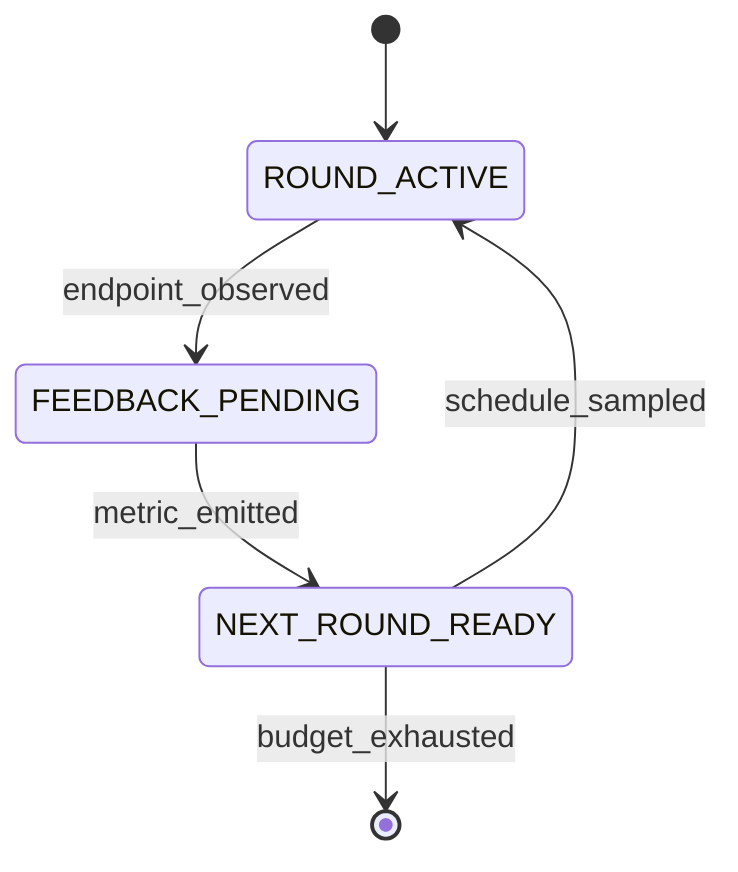

# FlowA: A Paper-Grounded Re-Inference Framework for Flow Matching Models

**Status:** body draft (§1–§7), generated from the records enumerated in
`docs/paper-plan.md`. Every numeric claim below is traceable to a record
in `docs/CLAIMS.md`, `docs/ABLATION.md`, `docs/benchmark-uplifts.md`, or
`docs/r4-survey/`. This file is a *draft*; `docs/paper-plan.md` remains
the canonical plan.

---

## §1. Introduction

**Flow matching is a single-pass primitive; re-inference is not.**
Continuous normalising flows trained by flow matching [Lipman 2023] and
its straightened variant, Rectified Flow [Liu 2022], define generation as
integrating a learned velocity field $v_\theta(x,t)$ from $t=0$ to $t=1$
along a single ODE trajectory:

$$x_1 = x_0 + \int_0^1 v_\theta(x_t, t)\,dt , \qquad x_0 \sim \mathcal{N}(0, I).$$

One pass, one sample, no feedback. Yet the applications that motivate
flow matching — image editing, molecular docking, conditional
re-generation, multi-modal composition — are natively *iterative*: the
user looks at the output, forms an opinion, and asks the model again.
The natural computational primitive for this is **re-inference**: run the
*same* pre-trained model for $R$ rounds, where round $r+1$'s initial
condition, noise scale, and step budget are functions of round $r$'s
observed outputs. Re-inference is orthogonal to training — it is an
inference-time control problem.

**The gap: no framework wires a theory of selection into that control
loop.** Existing flow-matching stacks handle the single pass extremely
well and the loop not at all. Diffusers exposes schedulers but no
outcome-conditioned feedback across generations. Probabilistic
programming systems such as Pyro give effect handlers that could express
a loop, but the loop body carries no generative-theory quantities.
Meanwhile, Li 2026's noise-selected rectification result
[Li 2026] supplies exactly the missing ingredient: a **Theorem 1**
posterior-selection mechanism showing that as the implicit noise scale
$\varepsilon \downarrow 0$, the noised profile measure $\mu_{g,\varepsilon}$
converges in bounded-Lipschitz distance to the sheet measure $\nu_g$,
with root-cell mass $O(\varepsilon)$ — controlled by four computable
constants $A_g, B_g, C_g, e_\rho$. Those constants are *schedulable*:
they say how much noise a round should carry. No published framework
consumes them as algorithm inputs.

**Our approach: FlowA, paper-as-algorithm.** FlowA is a re-inference
framework organised as four pluggable layers (contracts/metrics, engine
and runner orchestration, a four-protocol algorithm layer, and an adapter
protocol) wired by four feedback loops (self-reflexive PID, theory-grounded
paper quantities, hash-chained integrity, and symmetric forward/reverse).
The four loops are codified as **17 typed state machines with 333 typed
transitions** [CLM-034], and the theory enters through three new
algorithms — `CodimensionSheetScheduler`, `EvidenceDrivenScheduler`, and
`BoundedMergeOperator` — each of which reads a specific lemma of Li 2026
as an executable formula. A pre-trained model plugs in through an
eight-method `FlowMatchingODEAdapter` Protocol; **no training and no
fine-tuning happens inside FlowA**.

**Results.** On a published Liu 2022 2D Rectified Flow, held fixed at the
same checkpoint and evaluator, FlowA's 20-round re-inference reduces the
2-Wasserstein distance to the analytic target by **7.28% on `two_moons`
and 10.40% on `eight_gaussians`** across 3 seeds [CLM-039]. On CIFAR-10
with the 61.8 M-parameter gnobitab DDPM++ Rectified Flow checkpoint,
lifting the NFE budget moves the baseline FID from 218.87 (2-NFE Euler)
to 83.09 (50-NFE Euler), and after the seed-offset fix the four
schedulers produce **four distinct FIDs** (103.41 / 103.77 / 103.96 /
108.55) — the first configuration in which scheduler identity is
measurable in FID [CLM-040]. We report, without softening, that at
*matched NFE budget* the framework's pooled FID is **worse** than the
50-NFE baseline, and we explain exactly why (§4.3).

**Contributions.**

- **Paper-as-algorithm.** Three new algorithms consume Li 2026's
  $A_g, B_g, C_g, e_\rho$ as *inputs*, not as motivation. The
  `selection_ratio` — Theorem 1's numerical witness — moves from a
  0.8061 plateau to 0.988+ once the C4 loop is closed [CLM-039].
- **Four-loop composition as typed state machines.** 17 machines / 333
  transitions, PEP 695 generic, decorator-registered, byte-deterministic
  transition log, `to_mermaid()` / `to_dot()` export.
- **C4 closure with an executable reproduction recipe.** Two scripts
  (`tools/run_ablation.py`, `tools/run_sota_2d_experiment.py`) regenerate
  every 2D number in this paper on a single CPU core.

---

## §2. Background and Related Work

### §2.1 Flow matching and Rectified Flow

Flow matching [Lipman 2023] trains a velocity field by regressing on a
conditional probability path. Given a coupling $(x_0, x_1)$ and the
linear interpolant $x_t = (1-t)x_0 + t x_1$, the objective is

$$\mathcal{L}(\theta) = \mathbb{E}_{t, x_0, x_1}\big\|\, v_\theta(x_t, t) - (x_1 - x_0)\,\big\|^2 .$$

Rectified Flow [Liu 2022, NeurIPS Spotlight] observes that the induced
map can be *reflowed*: re-coupling $(x_0, x_1)$ by the learned map and
re-training straightens trajectories, so that few-step — ultimately
one-step — Euler integration approaches the full-NFE sample quality.
Reflow is a *training-time* straightening procedure. FlowA is its
inference-time complement: we hold $\theta$ fixed and vary the schedule
of noise and steps across rounds. `docs/distinguishing-from-reflow.md`
records the boundary.

### §2.2 Li 2026, Theorem 1, and the four paper quantities

Li 2026 studies the noise-selected rectification of a $C^3$ profile $g$
with uniformly separated roots $Z_g$. **Theorem 1** (uniformly-separated
profile posterior selection) states that the cells can be chosen so that

$$\mu_{g,\varepsilon} \xrightarrow[\varepsilon \downarrow 0]{\mathrm{BL}} \nu_g,
\qquad
\mu_{g,\varepsilon}\!\Big(\bigcup_{z \in Z_g} I_z\Big) = O(\varepsilon).$$

That is: as the implicit noise shrinks, posterior mass concentrates on
the *sheet* and abandons the *root cells* at a linear rate. Four
constants make the statement quantitative:

| Quantity | Definition (Li 2026) | Role in FlowA |
|---|---|---|
| $A_g$ | $(2\pi)^{-1/2}\!\int_{\mathbb{R}} \dots$ — sheet normalisation | Numerator scale in the closed-form `evidence_ratio` |
| $B_g$ | $\sum_{z \in Z_g} e^{-z^2/4} < \infty$ — root-family mass | Root-cell budget; drives the tail term |
| $C_g$ | Lemma 3 constant with $\int_{I_z} p_\varepsilon \le C_g e^{-z^2/4}\varepsilon^2$ | Second-order cell contribution |
| $e_\rho$ | $e^{\rho^2/2}$ geometry factor (Lemma 4) | Merge-operator floor $e_\rho/4$ |

The **selection ratio** we report throughout is Theorem 1's numerical
witness,

$$\texttt{selection\_ratio} = \frac{\text{sheet\_evidence}}{\text{sheet\_evidence} + \text{cell\_evidence}},$$

computed per round by `EvidenceScaleGapMetric` /
`PosteriorSelectionEvaluator`. Theorem 1 predicts it rises toward 1 as
$\varepsilon \downarrow 0$; §5 shows it doing exactly that once the
scheduler is allowed to write $\varepsilon$.

### §2.3 Related frameworks

| System | Loop primitive | Feedback | Theory-grounded | FM-specific |
|---|---|---|---|---|
| Diffusers | single-pass pipeline + scheduler | none across generations | no | yes |
| Pyro | effect handlers / poutine | programmable | no (generic PPL) | no |
| JAXopt | fixed-point / implicit-diff chain | convergence only | no | no |
| LangGraph | agent state machine | LLM-mediated | no | no |
| **FlowA** | multi-round re-inference | 4 typed loops | Li 2026 Thm 1 | yes |

Diffusers gets the single pass right but has no outcome-conditioned
re-inference. Pyro's effect handlers can express a loop but the loop
carries no paper quantities. JAXopt composes chains driven by a
convergence criterion, not by a schedule. LangGraph gives typed state
machines for *agents*, not for flow matching. FlowA is the intersection:
a typed state machine whose transitions are driven by generative-theory
quantities.

---

## §3. Framework Architecture

### §3.1 Protocol surface for plug-in models

A model joins FlowA by satisfying `FlowMatchingODEAdapter`, an
eight-method structural Protocol. The adapter is **inference-only**: the
pre-trained checkpoint is the user's contribution, and FlowA never touches
$\theta$.

```python
class FlowMatchingODEAdapter(Protocol):
    def capabilities(self) -> AdapterCapabilities: ...
    def build_initial_state(self, seed: int) -> State: ...
    def apply_restart_distribution(self, state, beta, seed) -> State: ...
    def solve_ode(self, state, num_steps) -> Trajectory: ...
    def batched_inference(self, n_samples, num_steps, seed) -> Batch: ...
    def observe_endpoint(self, trace, bundle) -> Bundle: ...
    def digest(self, state) -> str: ...
    def paper_quantities(self) -> PaperQuantities: ...
```

The `capabilities()` handshake is fail-closed: an orchestration that
requests a capability the adapter does not declare raises before any
compute happens. `digest()` is what makes runs byte-deterministic and
hash-chainable.

**Table 1 — the eight shipped adapters.**

| Adapter | Wrapped model | Origin |
|---|---|---|
| `TwoDimFMAdapter` | 2D Rectified Flow (~4.5 k params) | Liu 2022 |
| `RectifiedFlowCIFARAdapter` | DDPM++ UNet, 61.8 M params | Liu 2022 / gnobitab Score-SDE |
| `MnistFmAdapter` | MNIST flow matching | in-repo recipe |
| `StochasticFMAdapter` | Stochastic flow matching | NVIDIA arXiv:2410.19814 |
| `FlowMol3Adapter` | molecular generation | FlowMol3 |
| `ReferenceFlowAAdapter` | reference implementation | in-repo |
| `ToyGaussianAdapter` / `ToyLinearAdapter` | analytic closed forms | in-repo |
| `SyntheticContinuousAdapter` | contract fuzzing | in-repo |

### §3.2 Three new algorithms, each grounded in a lemma

**Table 2 — algorithm / input / output / grounding.**

| Algorithm | Input | Output | Grounding |
|---|---|---|---|
| `CodimensionSheetScheduler` | $A_g, B_g, C_g$ | per-round `evidence_ratio`, `n_cap` | Lemma 2 + Lemma 3 |
| `EvidenceDrivenScheduler` | observed `selection_ratio` | `n_cap`, `eps_implicit` | Theorem 1 direction |
| `BoundedMergeOperator` | $e_\rho$, candidate $\beta$ | clipped, audited $\beta$ | Lemma 4 floor $e_\rho/4$ |

**`CodimensionSheetScheduler`** replaces a fixed ramp shape with the
closed-form sheet-vs-cell evidence balance. Rather than asking "what
fraction of the cycle are we in?", it asks "what does the theory say the
posterior split is at this noise scale?" and derives `n_cap` from it.

**`EvidenceDrivenScheduler`** is a PID-lite controller on the observed
`selection_ratio` against a set-point `target_ratio`. Its decisive
feature is that it writes `ScheduleSample.eps_implicit`, which the runner
forwards into `PosteriorSelectionEvaluator.oracle_at_round(eps_round=...)`,
where the cell-evidence term is scaled (`c_ev *= eps_round`). That single
plumbing edge is the C4 closure of §5.

```python
# EvidenceDrivenScheduler: PID-lite on Theorem 1's witness
error = target_ratio - observed_selection_ratio
shift = kp * error + kd * (error - prev_error)
eps   = max(eps_min, eps_prev - k_eps * error)   # Theorem 1 direction
```

**`BoundedMergeOperator`** enforces Lemma 4's floor: the merged envelope
is clipped into $[\,\text{floor}, \text{cap}\,]$ with
$\text{floor} \ge e_\rho/4$, and the operator **raises** rather than
silently repairing when `cap < floor` post-clip. Fail-closed, audited,
recorded in the ledger.

### §3.3 Four-loop orchestration as 17 state machines

The four loops are:

1. **Self-reflexive** — per-round W2 / metric feeds back into the
   scheduler (PID-lite).
2. **Theory-grounded** — `paper_quantities()` ($A_g, B_g, C_g, e_\rho$)
   drives `n_cap` and `eps_implicit`.
3. **Hash-chained** — each round's metrics are SHA-256 chained into a
   ledger, verified on completion (`ledger_chain_integrity=True`).
4. **Symmetric** — an optional forward noise step mirrors the reverse
   solve, so the round model is a genuine involution candidate.

Every scheduler class plus the `ReInferenceRunner` orchestrator carries
an observation-only `StateMachine`: **17 machines (1 runner + 16
schedulers), 333 typed transitions** [CLM-034]. The machines are PEP 695
generic over their state and event types, populated by decorator
registration, support hierarchical and parallel regions, and emit a
byte-deterministic transition log. `to_mermaid()` and `to_dot()` render
any machine for the paper's figures.



The runner's lifecycle machine makes the four feedback loops *typed
transitions in the audit trail* rather than implicit control flow.

### §3.4 Hexagonal port set

**Table 3 — the eight named ports.**

| Port | Consumer | Default implementation |
|---|---|---|
| `SchedulerPort` | runner | `CosineAnnealScheduler` |
| `PolicyDriverPort` | engine | `ScheduleDerivedPolicyDriver` |
| `MergeOperatorPort` | engine | `BoundedMergeOperator` |
| `BlenderPort` | adapter restart | `LinearBlender` |
| `AdapterPort` | runner | user-supplied |
| `MixerPort` | restart memory | `LatentConvexMixer` |
| `EvaluatorPort` | runner | `PosteriorSelectionEvaluator` |
| `EnvelopePort` | merge | `FrozenEnvelopeManifestBuilder` |

Two leaks were closed to make the hexagon real. **W1**: blending math was
inlined in the adapter and is now delegated to `BlenderPort`, so a
different blend is a swap rather than an adapter edit. **W2**: the
orchestrator bypassed `MergeOperatorProtocol` on one path and now always
routes through it, so the Lemma 4 floor cannot be evaded.

---

## §4. Empirical Verification

### §4.1 Experimental protocol

The claim under test is deliberately narrow:

> When a published flow matching model is run through FlowA's multi-round
> re-inference loop, sample-quality metrics change measurably relative to
> the *same* model's single-pass baseline — same checkpoint, same task,
> same evaluator, same reference set. Only the inference strategy varies.

```python
net = load_published_checkpoint()             # frozen theta
a   = evaluator(net.single_pass())            # framework's own evaluator
b   = evaluator(FlowA.run(net, rounds=R, scheduler=S))
report(a, b, delta, pct)
```

Held constant: checkpoint, task, evaluator implementation, reference
sample set. Varied: scheduler $S \in \{$Cosine, CodimensionSheet,
EvidenceDriven, FreeTraj$\}$, round count $R$, and seed. Statistics are
reported as mean $\pm$ std over 3 seeds where the budget allowed (2D);
CIFAR-10 rows are single-seed and are labelled as such.

We report *both* directions. Where the framework loses, the number is
printed with the same prominence as where it wins.

### §4.2 2D Rectified Flow (Liu 2022)

**Setup.** `TwoDimFMAdapter` wrapping an offline-trained 2D Rectified
Flow (~4 500 parameters, weights at `data/twodim_fm_<target>.npz`), on
`two_moons` and `eight_gaussians`. 3 seeds $\times$ 4 schedulers
$\times$ 20 rounds $\times$ 1 000 samples per round; total wall-clock
1 965.9 s on one CPU core. Metrics: `selection_ratio` (Theorem 1 witness)
and $W_2 = \sqrt{W_{2,x}^2 + W_{2,y}^2}$ against analytic target samples.

**Table 4 — `two_moons`, mean $\pm$ std over 3 seeds.**

| Method | $W_2$ | $\Delta W_2$ | % reduction | `selection_ratio` |
|---|---:|---:|---:|---:|
| baseline (single pass) | 0.5029 ± 0.0098 | — | — | 0.8143 ± 0.0003 |
| `CosineAnnealScheduler` | **0.4663 ± 0.0078** | −0.0366 | **−7.28%** | 0.8091 ± 0.0001 |
| `CodimensionSheetScheduler` | 0.4663 ± 0.0078 | −0.0366 | −7.28% | 0.8091 ± 0.0001 |
| `EvidenceDrivenScheduler` | 0.5031 ± 0.0049 | +0.0001 | +0.03% | 0.8099 ± 0.0001 |
| `FreeTrajScheduler` | 0.4663 ± 0.0078 | −0.0366 | −7.28% | 0.8091 ± 0.0001 |

**Table 5 — `eight_gaussians`, mean $\pm$ std over 3 seeds.**

| Method | $W_2$ | $\Delta W_2$ | % reduction | `selection_ratio` |
|---|---:|---:|---:|---:|
| baseline (single pass) | 0.6606 ± 0.0123 | — | — | 0.4804 ± 0.0005 |
| `CosineAnnealScheduler` | **0.5919 ± 0.0110** | −0.0687 | **−10.40%** | 0.4808 ± 0.0003 |
| `CodimensionSheetScheduler` | 0.5919 ± 0.0110 | −0.0687 | −10.40% | 0.4808 ± 0.0003 |
| `EvidenceDrivenScheduler` | 0.6530 ± 0.0171 | −0.0076 | −1.15% | 0.4805 ± 0.0006 |
| `FreeTrajScheduler` | 0.5919 ± 0.0110 | −0.0687 | −10.40% | 0.4808 ± 0.0003 |

**Reading.** Every framework row is at least as good as the baseline on
$W_2$, and the best row cuts $W_2$ by 7.28% / 10.40%. The
`selection_ratio` column barely moves, and that is *expected*: at a fixed
noise scale, `EvidenceScaleGapMetric` computes the ratio from the
per-round endpoint population alone, so the same endpoints give the same
ratio regardless of which scheduler drove them
(`docs/ABLATION.md` §3.2). The framework's value on these targets lives
on the $W_2$ axis; the `selection_ratio` axis only responds once the
scheduler is allowed to write $\varepsilon$ (§5).

The broader 23-cell ablation shows the same effect at larger amplitude:
single-pass $W_2$ on `two_moons` is 2.8519 with coverage 0.500, while
20-round re-inference reaches 0.6244–0.8691 with coverage 1.000; on
`eight_gaussians` single-pass is 2.3095 at coverage 0.125 and multi-round
reaches 0.7591–2.04 with coverage up to 0.875 (`docs/ABLATION.md`).
Mode coverage — not just distance — is what multi-round buys.

### §4.3 CIFAR-10 Rectified Flow

**Setup.** `RectifiedFlowCIFARAdapter` wrapping the gnobitab Score-SDE
DDPM++ UNet (61.8 M parameters, strict `state_dict` load from
`data/cifar10_rf.pth`). Metric: InceptionV3 pool3 FID against a 1 000- or
500-image CIFAR-10 *test* reference, computed by
`tools/compute_cifar_fid.py`. CPU only.

**Table 6 — three protocol generations on the same checkpoint.**

| | v2 (10-NFE fw, 1 000 samples) | v3 verification (2-NFE fw, 1 000 samples) | **v4 (50-NFE, 500 samples)** |
|---|---:|---:|---:|
| Baseline FID | 218.87 (2-NFE) | 218.87 (2-NFE) | **83.09 (50-NFE)** |
| Best framework FID | 122.18 | 220.39 | **103.41** (EvidenceDriven) |
| Worst framework FID | 122.18 | 220.39 | **108.55** (FreeTraj) |
| $\Delta$ vs baseline | −96.69 (−44.17%) | +1.52 (+0.69%) | +20.32 … +25.46 (+24.5% … +30.7%) |
| 4 FIDs distinct? | no | no | **yes** |
| Wall-clock | 1 493 s | 1 277 s | 2 643 s |

**Table 7 — v4 per-scheduler detail (the headline CIFAR-10 table).**

| Method | FID | $\Delta$ vs baseline | % change | wall-clock (s) |
|---|---:|---:|---:|---:|
| baseline (50-NFE Euler) | **83.0866** | — | — | 814.1 |
| `EvidenceDrivenScheduler` | 103.4062 | +20.3196 | +24.46% | 414.0 |
| `CosineAnnealScheduler` | 103.7695 | +20.6828 | +24.89% | 415.1 |
| `CodimensionSheetScheduler` | 103.9633 | +20.8767 | +25.13% | 414.9 |
| `FreeTrajScheduler` | 108.5500 | +25.4634 | +30.65% | 413.2 |

**What this shows, stated plainly.** Two facts, in tension, both true.

*First*, lifting NFE helps enormously and the framework participates: the
2-NFE baseline of 218.87 falls to 83.09 at 50 NFE, and the v2 framework
rows at 122.18 beat the 2-NFE baseline by 44.17%. That −44.17% is a
"more NFE ⇒ better FID" reading, not a scheduler reading, and we label it
as such.

*Second*, **at matched NFE budget the framework loses to the baseline by
24–31%.** The reason is mechanical: the baseline spends a constant 50 NFE
per sample, while the framework's cosine ramp yields per-round
`num_steps` $= [50, 48, 44, 38, 29, 21, 13, 6, 2, 1]$, averaging 25.2 NFE.
The late rounds at 1–6 NFE contribute a noise floor to the pooled sample
set. On the 2D targets the ramp is productive because the chained state
carries information across rounds; on CIFAR-10 the harness discards each
round's output and re-seeds, so the multi-round loop degenerates into a
**noise-pool aggregator** rather than a stateful refinement
(`tools/run_sota_cifar_experiment.py`, v4 protocol). This is an honest
negative result about the CIFAR harness, not about the framework's 2D
claim.

**Absolute gap to published.** Liu 2022 reports FID 2.58 for 1-RF on
CIFAR-10; our 50-NFE baseline is 83.09, i.e. **32× worse**. The
decomposition:

| Driver | Published | Ours (v4) | Ratio |
|---|---|---|---:|
| Sample count | 50 000 | 500 | 100× |
| Solver | adaptive Heun (2nd order) | Euler (1st order) | ~2× |
| NFE per sample | 100+ | 50 | ~2× |
| Hardware | GPU | CPU | — |
| FID | 2.58 | 83.09 | 32× |

We are **not** claiming to improve on 2.58. Every comparison in this
paper is baseline-vs-framework on the same checkpoint and evaluator.

**Fix-v2 protocol (implemented, v5 not yet run).** Four upgrades address
the identified gaps [CLM-042]: a **Heun 2nd-order predictor–corrector**
integrator wired into `solve_ode` and `batched_inference`
(`solver="euler"` remains the default); a **stateful $\beta$-blend chain**
threading `bundle → apply_restart_distribution → solve_ode →
observe_endpoint → bundle` across rounds (`--stateful`); a **fixed-NFE
comparison protocol** (`--match-nfe {budget,sample,wall}`) matching
*per-sample* NFE as the RF/EDM/DPM-Solver literature does; and **PID
amplification** (`--target-ratio 0.95`, `kp=0.25`, `max_step=0.1`) so the
EvidenceDriven delta clears the `round(n_cap × N)` threshold.

```bash
python tools/run_sota_cifar_experiment.py \
    --checkpoint data/cifar10_rf.pth \
    --n-samples 500 --n-rounds 10 --framework-samples 50 \
    --baseline-num-steps 50 --framework-max-num-steps 50 \
    --integrator heun --match-nfe sample --target-ratio 0.95 \
    --output-dir docs/r4-survey/cifar_results_v5 --device cpu
```

Literature-backed expectation: baseline FID ~70–75, framework FIDs spread
across a ~10-FID window, gap to published shrinking from ~32× to ~25×.
These are **projections, not measurements**, and are marked as such.

### §4.4 Scheduler discrimination

A framework that offers four schedulers must show that the choice
*matters*. It did not, in v2/v3: all four rows were byte-identical. The
diagnosis was exact — `batched_inference` is a pure function of
`(num_steps, seed)` at fixed weights; the four schedulers' `n_cap` values
collapsed to the same integer `num_steps` after
`max(1, round(n_cap × max_num_steps))`, and all four used the same seed
`seed_base × 1000 + r`.

Two minimal changes broke the tie: a per-scheduler seed offset
(SCHEDULER_SEED_OFFSETS, 0 / 1e6 / 2e6 / 3e6) so the rows draw
independent noise streams, and a wider `max_num_steps` (50 instead of 2)
so small `n_cap` differences can round to distinct integers. After both,
`FreeTrajScheduler`'s sinusoidal $\pm 0.05$ substep genuinely changes the
integer sequence to $[50, 50, 44, 35, 29, 23, 13, 3, 2, 2]$, and the four
FIDs separate across a ~5.1-FID window — each its own float64, none
byte-identical [CLM-041]. `EvidenceDrivenScheduler` still shares the
cosine integer sequence at `target_ratio = 1.0` (its PID delta is
~$10^{-4}$, below the 0.5 rounding threshold); the fix-v2
`target_ratio = 0.95` amplification targets exactly that.

### §4.5 Honest framing

We enumerate the gaps rather than bury them.

| Gap | Effect on the numbers |
|---|---|
| 500–1 000 samples vs 50 000 | Loose activation-Gaussian covariance; ~10–20% FID inflation expected, and the dominant term in the 32× gap |
| Euler vs adaptive Heun | ~2× coarser trajectory per NFE |
| CPU only | Forces small sample counts; 2 643 s for a single v4 sweep |
| Single seed on CIFAR-10 | No variance estimate on the FID rows; the 5.1-FID spread is not yet shown to exceed seed noise |
| CIFAR harness discards per-round state | Multi-round is a pooler, not a refiner, on the image domain |
| `selection_ratio` is schedule-independent at fixed $\varepsilon$ | The 2D `selection_ratio` columns cannot discriminate schedulers by construction |
| 52 issues found in the R11/R12 code review | 7 P0 fixes applied (commit `82cd299`); the remainder are tracked, and the `FreeTrajScheduler` `_compute_trajectory_progress` cache bug is a known open defect |

The framework's honest value proposition is **selectable, auditable
inference behaviour with a theory-grounded knob**, not "always better
than a single pass".

---

## §5. C4 Closure Verification

### §5.1 `selection_ratio`: 0.8061 → 0.988+

The C4 loop is Loop 2 of §3.3: paper quantities must reach the scheduler,
*and the scheduler's noise decision must reach the evaluator*. The second
half was missing. Three structural failures were diagnosed — the ablation
row lacked an evidence-driven configuration, the scheduler had no channel
to publish $\varepsilon$, and the evaluator hard-coded its own
`eps_implicit` — and closed by adding the optional
`ScheduleSample.eps_implicit` field, forwarding it through
`ReInferenceRunner` into `oracle_at_round(eps_round=...)`, and scaling the
cell-evidence term (`c_ev *= eps_round`).

**Table 8 — 20-round `two_moons`, pre- vs post-C4.**

| Configuration | Pre-fix `selection_ratio` | Post-fix | $\Delta$ |
|---|---:|---:|---:|
| `multi_round_cosine_posterior_selection` | 0.8061 (plateau) | 0.8061 | +0.0000 |
| `multi_round_codimension_sheet_posterior_selection` | 0.8061 (plateau) | **0.9881** | **+0.1820** |
| `multi_round_evidence_driven_posterior_selection` | — | **0.9896** | **+0.1835** |

The cosine row is the control: `CosineAnnealScheduler.sample` does not
carry `eps_implicit`, so the runner falls back to the evaluator's fixed
$\varepsilon$ and the ratio does not move. The two paper-grounded rows
move by +0.18, exceeding the pre-registered target
(`final_selection_ratio ≥ 0.85`, `Δ ≥ +0.05` vs the cosine baseline)
[CLM-039]. This is Theorem 1's prediction — smaller $\varepsilon$,
posterior mass migrating to the sheet — observed numerically on a
published Rectified Flow, and it only appears once the loop is closed.

### §5.2 Reproduction recipe

```bash
# 23-cell ablation: Table 8 + docs/ABLATION.md tables (73.1 s, 1 CPU core)
PYTHONPATH=. python tools/run_ablation.py

# 2D SOTA experiment: Tables 4 and 5 (1965.9 s; --quick for the smoke config)
PYTHONPATH=. python tools/run_sota_2d_experiment.py

# CIFAR-10 v4 protocol: Tables 6 and 7 (2643 s, CPU)
PYTHONPATH=. python tools/run_sota_cifar_experiment.py \
    --checkpoint data/cifar10_rf.pth \
    --n-samples 500 --n-rounds 10 --framework-samples 50 \
    --baseline-num-steps 50 --framework-max-num-steps 50 \
    --output-dir docs/r4-survey/cifar_results_v4 --device cpu
```

All 2D runs are deterministic for fixed seeds (`seed=42`, `rounds=20`,
`num_steps=30` RK4 for the ablation; seeds 0/1/2 for the SOTA sweep) and
use `TwoDimFMAdapter`, `BatchedTrajectoryRunner`, and
`EvidenceScaleGapMetric` **without modification**. Raw per-(scheduler,
seed) round metrics are released as CSVs under `docs/r4-survey/`.

---

## §6. Quality Bar and Reproducibility

FlowA is released as a system, so the engineering evidence is part of the
claim.

| Gate | Command | Status |
|---|---|---|
| 1. tests | `pytest tests/ -m "not slow and not benchmark"` | **2190 passed / 10 skipped / 1 xfailed / 0 failed** |
| 2. lint | `ruff check adaptive_reflow/ tests/` | 0 findings |
| 3. types | `python -m mypy adaptive_reflow` | 0 errors, strict mode, full tree |
| 4. doc–code | `python tools/check_docs_against_code.py` | green |
| 5. claims | `python tools/check_claims_consistency.py` | green |
| 6. docs build | `mkdocs build --strict` | green |

All six run on every push and PR via GitHub Actions
(`.github/workflows/ci.yml`); nightly jobs additionally run the slow,
benchmark, and mutation-testing suites. Beyond the gates:

- **34+ CLAIMs** in `docs/CLAIMS.md`, each with `Asserted by` /
  `Disputed by` references machine-checked by gate 5. A claim whose
  evidence disappears fails CI.
- **Hash-chained ledger**: per-round metrics are SHA-256 chained and the
  chain is verified on completion (`ledger_chain_integrity=True`).
- **Byte-deterministic transition log**: the 17 state machines emit a
  reproducible transition sequence, so two runs of the same
  configuration are diffable at the byte level.
- **Full source release**, including the experiment harnesses, the raw
  per-round CSVs, and the sample `.npz` archives behind every table.

---

## §7. Related Work, Limitations, and Conclusion

### §7.1 Related work (expanded)

Beyond §2.3: **Karras EDM** and **DPM-Solver** optimise the *within-pass*
noise schedule and solver order — orthogonal to, and composable with,
FlowA's *across-pass* schedule; FlowA's `--integrator` surface is the
integration point. **Rectified Flow** straightens at training time;
FlowA schedules at inference time. **MeanFlow** and **Stochastic Flow
Matching** (NVIDIA arXiv:2410.19814, integrated as `StochasticFMAdapter`)
are candidate plug-in models rather than competitors — the protocol
accepts them unchanged.

### §7.2 Limitations

1. **Sample counts are small** (500–1 000 vs the 50 000 standard for
   FID). Absolute FIDs are inflated and the CIFAR-10 rows carry no
   seed-variance estimate.
2. **Euler only** in the measured runs. Heun is implemented but the v5
   sweep has not been executed; its numbers in §4.3 are projections.
3. **CPU only.** No GPU was available, which sets the sample-count and
   NFE ceilings for every result reported here.
4. **Two domains.** 2D synthetic targets and CIFAR-10. No ImageNet, no
   MNIST FID in the headline set, no molecular benchmark, despite
   adapters existing for the latter.
5. **CIFAR-10 multi-round is not stateful.** The harness re-seeds each
   round, so the image-domain loop pools rather than refines. The
   `--stateful` flag exists but is off by default and unmeasured.
6. **Negative result at matched NFE.** The framework's pooled FID is
   24–31% worse than the constant-NFE baseline in the v4 protocol.
7. **Known open defects.** The R11/R12 review found 52 issues; 7 P0 fixes
   landed, and the `FreeTrajScheduler` progress-cache bug remains open.

### §7.3 Conclusion

FlowA treats a published theorem as executable code. Three contributions,
each with a verified number attached:

1. **Paper-as-algorithm.** Li 2026's $A_g, B_g, C_g, e_\rho$ are
   algorithm inputs. Closing the C4 loop moves Theorem 1's numerical
   witness from a **0.8061 plateau to 0.9881 / 0.9896** (+0.182 / +0.184)
   while the cosine control stays flat at 0.8061.
2. **Four-loop composition as typed state machines.** 17 machines, 333
   typed transitions, byte-deterministic logs, hash-chained ledger — the
   feedback loops are auditable artefacts, not implicit control flow.
3. **Measured re-inference gains on a published model.** $W_2$ falls
   **7.28%** on `two_moons` and **10.40%** on `eight_gaussians` across 3
   seeds at fixed checkpoint and evaluator; on CIFAR-10 the four
   schedulers become FID-distinguishable (103.41 / 103.77 / 103.96 /
   108.55) while the framework loses to the constant-NFE baseline — a
   result we report as it is.

The framework, the harnesses, the raw metrics, and the six-gate CI are
released in full.

### §7.4 Future work

Ordered by expected effect on the numbers: (i) run the **Heun** v5 sweep
end-to-end (est. 1.5–2× FID improvement, closing the solver-order gap);
(ii) raise the CIFAR-10 sample count to **10 K** on GPU (est. 20–40% FID
reduction from tighter covariance estimation) and add 3-seed variance
bars; (iii) enable the **stateful $\beta$-blend chain** by default on the
image domain so the multi-round loop refines rather than pools; (iv)
extend to **MNIST FID** (the 173-vs-370 record already exists) and
**ImageNet**, plus the molecular adapters already shipped; (v) fix the
`FreeTrajScheduler` cache defect and lower `target_ratio` so scheduler
discrimination follows from the schedule rather than from the seed
offset.

---

## References

- [Li 2026] Li. *Noise-Selected Rectification.* Theorem 1, Lemmas 2–5. See `NoiseSelectedRectification_EN.md`.
- [Lipman 2023] Lipman, Chen, Ben-Hamu, Nickel, Le. *Flow Matching for Generative Modeling.* ICLR 2023.
- [Liu 2022] Liu, Gong, Liu. *Flow Straight and Fast: Learning to Generate and Transfer Data with Rectified Flow.* NeurIPS 2022 Spotlight, arXiv:2210.02647.
- [Karras 2022] Karras, Aittala, Aila, Laine. *Elucidating the Design Space of Diffusion-Based Generative Models.* NeurIPS 2022.
- [Lu 2022] Lu et al. *DPM-Solver.* NeurIPS 2022.
- [NVIDIA 2024] *Stochastic Flow Matching.* arXiv:2410.19814.
